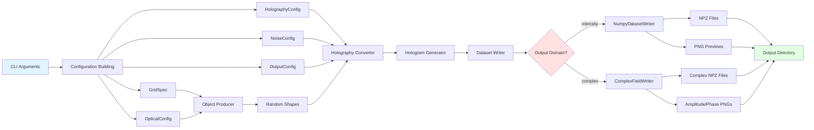
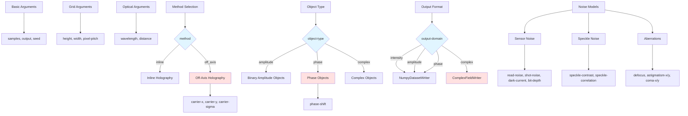

# Command-Line Interface Reference

HoloGen provides a powerful command-line interface for generating holography datasets without writing Python code. The `generate_dataset.py` script offers comprehensive control over all aspects of dataset generation, from optical parameters to noise simulation.

## Quick Start

Generate a basic dataset with default settings:

```bash
python scripts/generate_dataset.py --samples 100 --output my_dataset
```

This creates 100 hologram samples in the `my_dataset/` directory using inline holography with default optical parameters.

## Basic Usage

```bash
python scripts/generate_dataset.py [OPTIONS]
```

The CLI organizes arguments into logical categories: basic parameters, grid configuration, optical settings, holography method, object type, output format, and noise simulation.

## CLI Workflow Diagram

The following diagram illustrates the complete workflow from CLI arguments to output files:



**Workflow Steps**:
1. **Parse Arguments**: CLI arguments are validated and parsed
2. **Build Configuration**: Arguments are converted to configuration objects
3. **Initialize Pipeline**: Producer, converter, and writer are created
4. **Generate Samples**: Random shapes are generated and propagated
5. **Apply Noise**: Optional noise models are applied to holograms
6. **Write Output**: Samples are saved as NPZ files with optional PNG previews

## Argument Reference

### Basic Arguments

Control the fundamental aspects of dataset generation.

#### `--samples`
- **Type**: Integer
- **Default**: `10`
- **Description**: Number of hologram samples to generate
- **Example**: `--samples 1000`
- **Notes**: Larger datasets take longer to generate but provide more training data

#### `--output`
- **Type**: Path
- **Default**: `dataset`
- **Description**: Output directory where generated samples will be saved
- **Example**: `--output ./training_data/holograms`
- **Notes**: Directory will be created if it doesn't exist; existing files may be overwritten

#### `--seed`
- **Type**: Integer
- **Default**: `42`
- **Description**: Random seed for reproducible dataset generation
- **Example**: `--seed 12345`
- **Notes**: Use the same seed to regenerate identical datasets; different seeds produce different random shapes and noise patterns

### Grid Arguments

Define the spatial sampling grid for both object and sensor planes.

#### `--height`
- **Type**: Integer
- **Default**: `256`
- **Description**: Height of the object and sensor planes in pixels
- **Example**: `--height 512`
- **Valid Range**: Positive integer, typically powers of 2 for FFT efficiency
- **Notes**: Larger grids increase memory usage and computation time

#### `--width`
- **Type**: Integer
- **Default**: `256`
- **Description**: Width of the object and sensor planes in pixels
- **Example**: `--width 512`
- **Valid Range**: Positive integer, typically powers of 2 for FFT efficiency
- **Notes**: Non-square grids are supported

#### `--pixel-pitch`
- **Type**: Float
- **Default**: `4.65e-6` (4.65 μm)
- **Description**: Physical size of each pixel in meters
- **Example**: `--pixel-pitch 3.45e-6`
- **Valid Range**: Positive float, typically 1-10 μm for typical cameras
- **Notes**: Affects spatial resolution and diffraction patterns; should match your target camera sensor

### Optical Arguments

Configure the optical system parameters.

#### `--wavelength`
- **Type**: Float
- **Default**: `532e-9` (532 nm, green laser)
- **Description**: Illumination wavelength in meters
- **Example**: `--wavelength 633e-9` (red HeNe laser)
- **Common Values**:
  - `405e-9`: Violet laser
  - `532e-9`: Green laser (default)
  - `633e-9`: Red HeNe laser
  - `650e-9`: Red diode laser
- **Notes**: Wavelength affects diffraction patterns and fringe spacing

#### `--distance`
- **Type**: Float
- **Default**: `0.02` (20 mm)
- **Description**: Propagation distance between object and sensor planes in meters
- **Example**: `--distance 0.05`
- **Valid Range**: Positive float, typically 1-100 mm
- **Notes**: Larger distances create more pronounced diffraction patterns but may violate paraxial approximation

### Holography Method Arguments

Select and configure the holography recording method.

#### `--method`
- **Type**: String (choice)
- **Default**: `inline`
- **Choices**: `inline`, `off_axis`
- **Description**: Holography recording method
- **Example**: `--method off_axis`
- **Notes**: 
  - `inline`: Simpler, but twin image and zero-order terms overlap
  - `off_axis`: Separates signal in frequency domain, enables cleaner reconstruction

#### Off-Axis Carrier Parameters

These parameters only apply when `--method off_axis` is selected.

##### `--carrier-x`
- **Type**: Float
- **Default**: `1600.0`
- **Description**: Carrier frequency along x-axis in cycles per meter
- **Example**: `--carrier-x 2000.0`
- **Valid Range**: Positive float, typically 1000-5000 cycles/m
- **Notes**: Higher frequencies separate signal better but require finer sampling

##### `--carrier-y`
- **Type**: Float
- **Default**: `1600.0`
- **Description**: Carrier frequency along y-axis in cycles per meter
- **Example**: `--carrier-y 2000.0`
- **Valid Range**: Positive float, typically 1000-5000 cycles/m
- **Notes**: Can be different from carrier-x for diagonal carrier orientation

##### `--carrier-sigma`
- **Type**: Float
- **Default**: `400.0`
- **Description**: Gaussian filter width (sigma) in cycles per meter for frequency domain filtering
- **Example**: `--carrier-sigma 300.0`
- **Valid Range**: Positive float, typically 200-600 cycles/m
- **Notes**: Smaller values create sharper filtering but may clip signal; larger values include more noise

### Object Type Arguments

Control the object domain field representation.

#### `--object-type`
- **Type**: String (choice)
- **Default**: `amplitude`
- **Choices**: `amplitude`, `phase`, `complex`
- **Description**: Type of object field to generate
- **Example**: `--object-type phase`
- **Usage**:
  - `amplitude`: Binary amplitude objects (opaque shapes on transparent background)
  - `phase`: Phase-only objects (transparent with phase modulation)
  - `complex`: Full complex fields with both amplitude and phase variations
- **Notes**: See COMPLEX_FIELDS.md for detailed explanation of each type

#### `--phase-shift`
- **Type**: Float
- **Default**: `1.5708` (π/2 radians)
- **Description**: Phase shift in radians for phase-only objects
- **Example**: `--phase-shift 3.14159` (π radians)
- **Valid Range**: `[0, 2π]` (0 to 6.28319 radians)
- **Notes**: Only applies when `--object-type phase`; determines the phase difference between object and background
- **Validation**: Script will reject values outside [0, 2π] range

### Output Arguments

Configure the output file format and representation.

#### `--output-domain`
- **Type**: String (choice)
- **Default**: `intensity`
- **Choices**: `intensity`, `amplitude`, `phase`, `complex`
- **Description**: Hologram output field representation
- **Example**: `--output-domain complex`
- **Usage**:
  - `intensity`: Standard intensity holograms (real-valued, non-negative)
  - `amplitude`: Field amplitude (real-valued, non-negative)
  - `phase`: Phase-only representation (real-valued, [-π, π])
  - `complex`: Full complex field (complex-valued, preserves all information)
- **Notes**: Complex output requires more storage but preserves complete field information

#### `--no-preview`
- **Type**: Flag (boolean)
- **Default**: `False` (previews enabled)
- **Description**: Disable PNG preview image generation
- **Example**: `--no-preview`
- **Notes**: Disabling previews speeds up generation and reduces disk usage for large datasets

### Noise Simulation Arguments

Add realistic optical and sensor noise to holograms. All noise parameters default to zero (no noise).

#### Sensor Noise Parameters

Simulate camera sensor imperfections.

##### `--sensor-read-noise`
- **Type**: Float
- **Default**: `0.0` (disabled)
- **Description**: Read noise standard deviation (Gaussian noise added to each pixel)
- **Example**: `--sensor-read-noise 5.0`
- **Typical Range**: 1-20 for typical cameras
- **Units**: Intensity units (same as hologram values)
- **Notes**: Models electronic noise in sensor readout circuitry

##### `--sensor-shot-noise`
- **Type**: Flag (boolean)
- **Default**: `False` (disabled)
- **Description**: Enable Poisson shot noise (photon counting statistics)
- **Example**: `--sensor-shot-noise`
- **Notes**: Automatically scales with signal intensity; more realistic for low-light conditions

##### `--sensor-dark-current`
- **Type**: Float
- **Default**: `0.0` (disabled)
- **Description**: Dark current mean value (constant offset added to all pixels)
- **Example**: `--sensor-dark-current 10.0`
- **Typical Range**: 1-50 for typical cameras
- **Units**: Intensity units
- **Notes**: Models thermal electrons generated in sensor even without illumination

##### `--sensor-bit-depth`
- **Type**: Integer
- **Default**: `None` (disabled, no quantization)
- **Description**: ADC bit depth for quantization
- **Example**: `--sensor-bit-depth 12`
- **Common Values**: 8, 10, 12, 14, 16
- **Notes**: Simulates analog-to-digital conversion; lower bit depths create visible quantization artifacts

#### Speckle Noise Parameters

Simulate coherent laser speckle patterns.

##### `--speckle-contrast`
- **Type**: Float
- **Default**: `0.0` (disabled)
- **Description**: Speckle contrast ratio
- **Example**: `--speckle-contrast 0.3`
- **Valid Range**: `[0.0, 1.0]`
- **Typical Range**: 0.1-0.5 for partially coherent sources
- **Notes**: Higher values create more pronounced speckle patterns; 1.0 represents fully developed speckle

##### `--speckle-correlation`
- **Type**: Float
- **Default**: `1.0`
- **Description**: Speckle correlation length in pixels
- **Example**: `--speckle-correlation 2.5`
- **Valid Range**: Positive float, typically 0.5-5.0 pixels
- **Notes**: Controls the spatial scale of speckle grains; smaller values create finer speckle

#### Aberration Parameters

Simulate optical aberrations using Zernike polynomials.

##### `--aberration-defocus`
- **Type**: Float
- **Default**: `0.0` (disabled)
- **Description**: Defocus aberration coefficient (Zernike Z₄)
- **Example**: `--aberration-defocus 0.5`
- **Typical Range**: -2.0 to 2.0
- **Units**: Waves of aberration
- **Notes**: Positive values simulate forward defocus, negative values simulate backward defocus

##### `--aberration-astigmatism-x`
- **Type**: Float
- **Default**: `0.0` (disabled)
- **Description**: Astigmatism along x-axis coefficient (Zernike Z₃)
- **Example**: `--aberration-astigmatism-x 0.3`
- **Typical Range**: -1.0 to 1.0
- **Units**: Waves of aberration
- **Notes**: Creates different focus in horizontal and vertical directions

##### `--aberration-astigmatism-y`
- **Type**: Float
- **Default**: `0.0` (disabled)
- **Description**: Astigmatism along y-axis coefficient (Zernike Z₅)
- **Example**: `--aberration-astigmatism-y 0.3`
- **Typical Range**: -1.0 to 1.0
- **Units**: Waves of aberration
- **Notes**: Orthogonal to x-astigmatism

##### `--aberration-coma-x`
- **Type**: Float
- **Default**: `0.0` (disabled)
- **Description**: Coma along x-axis coefficient (Zernike Z₇)
- **Example**: `--aberration-coma-x 0.2`
- **Typical Range**: -0.5 to 0.5
- **Units**: Waves of aberration
- **Notes**: Creates comet-like asymmetric blur

##### `--aberration-coma-y`
- **Type**: Float
- **Default**: `0.0` (disabled)
- **Description**: Coma along y-axis coefficient (Zernike Z₈)
- **Example**: `--aberration-coma-y 0.2`
- **Typical Range**: -0.5 to 0.5
- **Units**: Waves of aberration
- **Notes**: Orthogonal to x-coma

## Command Templates

Quick-reference templates for common scenarios. Replace values in `<angle brackets>` with your specific parameters.

### Template 1: Basic Dataset
```bash
python scripts/generate_dataset.py \
    --samples <NUM_SAMPLES> \
    --output <OUTPUT_DIR> \
    --seed <RANDOM_SEED>
```

### Template 2: Custom Grid and Optics
```bash
python scripts/generate_dataset.py \
    --samples <NUM_SAMPLES> \
    --output <OUTPUT_DIR> \
    --height <HEIGHT_PIXELS> \
    --width <WIDTH_PIXELS> \
    --pixel-pitch <PITCH_METERS> \
    --wavelength <WAVELENGTH_METERS> \
    --distance <DISTANCE_METERS>
```

### Template 3: Off-Axis with Complex Output
```bash
python scripts/generate_dataset.py \
    --samples <NUM_SAMPLES> \
    --output <OUTPUT_DIR> \
    --method off_axis \
    --carrier-x <CARRIER_X> \
    --carrier-y <CARRIER_Y> \
    --carrier-sigma <SIGMA> \
    --output-domain complex
```

### Template 4: Phase Objects
```bash
python scripts/generate_dataset.py \
    --samples <NUM_SAMPLES> \
    --output <OUTPUT_DIR> \
    --object-type phase \
    --phase-shift <PHASE_RADIANS> \
    --output-domain <intensity|amplitude|phase|complex>
```

### Template 5: Full Noise Simulation
```bash
python scripts/generate_dataset.py \
    --samples <NUM_SAMPLES> \
    --output <OUTPUT_DIR> \
    --sensor-read-noise <SIGMA> \
    --sensor-shot-noise \
    --sensor-dark-current <MEAN> \
    --sensor-bit-depth <BITS> \
    --speckle-contrast <RATIO> \
    --speckle-correlation <LENGTH> \
    --aberration-defocus <COEFF>
```

### Template 6: High-Performance Large-Scale
```bash
python scripts/generate_dataset.py \
    --samples <NUM_SAMPLES> \
    --output <OUTPUT_DIR> \
    --height <HEIGHT> \
    --width <WIDTH> \
    --no-preview \
    --seed <SEED>
```

## Common Usage Patterns

### Pattern 1: Default Dataset

Generate a basic dataset with default parameters for quick testing:

```bash
python scripts/generate_dataset.py --samples 100 --output test_dataset
```

**What it does**:
- 100 samples
- 256×256 pixels
- Inline holography
- Amplitude objects
- Intensity output
- No noise
- Green laser (532 nm)
- 20 mm propagation distance

**Use case**: Quick prototyping and testing

### Pattern 2: Phase-Only Objects

Generate transparent phase objects (e.g., biological cells):

```bash
python scripts/generate_dataset.py \
    --samples 500 \
    --output phase_dataset \
    --object-type phase \
    --phase-shift 1.57 \
    --output-domain intensity
```

**What it does**:
- Phase-only objects with π/2 phase shift
- Simulates transparent samples
- Standard intensity output

**Use case**: Quantitative phase imaging, biological sample simulation

### Pattern 3: Off-Axis Holography

Generate off-axis holograms with frequency domain separation:

```bash
python scripts/generate_dataset.py \
    --samples 1000 \
    --output offaxis_dataset \
    --method off_axis \
    --carrier-x 2000 \
    --carrier-y 2000 \
    --carrier-sigma 400 \
    --output-domain complex
```

**What it does**:
- Off-axis recording with 2000 cycles/m carrier
- Complex field output for reconstruction
- Enables twin-image separation

**Use case**: High-quality holographic reconstruction, research applications

### Pattern 4: Noisy Realistic Dataset

Generate holograms with realistic sensor and optical noise:

```bash
python scripts/generate_dataset.py \
    --samples 2000 \
    --output noisy_dataset \
    --sensor-read-noise 8.0 \
    --sensor-shot-noise \
    --sensor-dark-current 15.0 \
    --sensor-bit-depth 12 \
    --speckle-contrast 0.25 \
    --speckle-correlation 1.5 \
    --aberration-defocus 0.3
```

**What it does**:
- Read noise (σ=8)
- Poisson shot noise
- Dark current offset
- 12-bit quantization
- Moderate speckle
- Slight defocus

**Use case**: Training robust ML models, matching experimental conditions

### Pattern 5: Large-Scale High-Resolution

Generate a large dataset with high spatial resolution:

```bash
python scripts/generate_dataset.py \
    --samples 10000 \
    --output large_dataset \
    --height 512 \
    --width 512 \
    --pixel-pitch 3.45e-6 \
    --no-preview \
    --seed 2024
```

**What it does**:
- 10,000 samples
- 512×512 resolution
- Smaller pixel pitch (3.45 μm)
- No preview images (faster, less disk space)
- Reproducible with seed

**Use case**: Large-scale ML training, high-resolution applications

### Pattern 6: Custom Optical Configuration

Match specific experimental setup:

```bash
python scripts/generate_dataset.py \
    --samples 500 \
    --output custom_optics \
    --wavelength 633e-9 \
    --distance 0.05 \
    --pixel-pitch 5.2e-6 \
    --height 1024 \
    --width 1024
```

**What it does**:
- Red HeNe laser (633 nm)
- 50 mm propagation distance
- 5.2 μm pixel pitch
- 1024×1024 resolution

**Use case**: Matching specific experimental hardware, validation studies

### Pattern 7: Complex Field Pipeline

Generate full complex fields for advanced processing:

```bash
python scripts/generate_dataset.py \
    --samples 1000 \
    --output complex_dataset \
    --object-type complex \
    --output-domain complex \
    --method off_axis \
    --no-preview
```

**What it does**:
- Complex object fields
- Complex hologram output
- Off-axis method
- No previews (complex fields need special visualization)

**Use case**: Physics-aware neural networks, full wave optics simulation

## Argument Dependency Diagram

The following diagram shows how different argument categories relate to each other and which arguments depend on others:



**Key Dependencies**:
- **Carrier parameters** (carrier-x, carrier-y, carrier-sigma) only apply when `method=off_axis`
- **Phase shift** only applies when `object-type=phase`
- **ComplexFieldWriter** is automatically selected when `output-domain=complex`
- **All noise parameters** are independent and can be combined freely

## Argument Combinations

### Valid Combinations

Some arguments work together or depend on each other:

1. **Off-Axis Carrier Parameters**: Only used when `--method off_axis`
   ```bash
   --method off_axis --carrier-x 2000 --carrier-y 2000 --carrier-sigma 400
   ```

2. **Phase Shift**: Only applies when `--object-type phase`
   ```bash
   --object-type phase --phase-shift 1.57
   ```

3. **Complex Output**: Automatically selects ComplexFieldWriter
   ```bash
   --output-domain complex  # Uses ComplexFieldWriter instead of NumpyDatasetWriter
   ```

4. **Multiple Noise Sources**: Can combine any noise parameters
   ```bash
   --sensor-read-noise 5.0 --sensor-shot-noise --speckle-contrast 0.2
   ```

### Incompatible Combinations

Some argument combinations don't make sense or will be ignored:

1. **Carrier parameters with inline method**: Carrier parameters are ignored for inline holography
   ```bash
   # carrier-x, carrier-y, carrier-sigma have no effect here
   --method inline --carrier-x 2000
   ```

2. **Phase shift with non-phase objects**: Phase shift is ignored for amplitude or complex objects
   ```bash
   # phase-shift has no effect here
   --object-type amplitude --phase-shift 3.14
   ```

## Validation and Error Messages

The CLI performs validation on input arguments and provides helpful error messages.

### Phase Shift Validation

```bash
python scripts/generate_dataset.py --phase-shift 10.0
```

**Error**:
```
usage: generate_dataset.py [-h] [--phase-shift PHASE_SHIFT]
generate_dataset.py: error: argument --phase-shift: Phase shift must be in [0, 2π] range, got 10.0000
```

**Solution**: Use a value between 0 and 2π (0 to 6.28319):
```bash
python scripts/generate_dataset.py --phase-shift 3.14159
```

### Invalid Method Choice

```bash
python scripts/generate_dataset.py --method fourier
```

**Error**:
```
usage: generate_dataset.py [-h] [--method {inline,off_axis}]
generate_dataset.py: error: argument --method: invalid choice: 'fourier' (choose from 'inline', 'off_axis')
```

**Solution**: Use one of the valid choices:
```bash
python scripts/generate_dataset.py --method off_axis
```

### Invalid Object Type

```bash
python scripts/generate_dataset.py --object-type intensity
```

**Error**:
```
usage: generate_dataset.py [-h] [--object-type {amplitude,phase,complex}]
generate_dataset.py: error: argument --object-type: invalid choice: 'intensity' (choose from 'amplitude', 'phase', 'complex')
```

**Solution**: Use a valid object type:
```bash
python scripts/generate_dataset.py --object-type amplitude
```

### Missing Output Directory

If the output directory doesn't exist, it will be created automatically. No error is raised.

### Negative or Zero Samples

```bash
python scripts/generate_dataset.py --samples 0
```

**Behavior**: Will generate 0 samples (empty dataset). While not an error, this is likely not intended.

**Recommendation**: Use positive integer for `--samples`.

## Performance Considerations

### Memory Usage

Memory usage scales with:
- Grid size: `height × width` pixels
- Number of samples generated in memory
- Output representation (complex fields use 2× memory)

**Recommendations**:
- For large datasets (>10,000 samples), generate in batches
- Use `--no-preview` to reduce memory usage
- Monitor system memory with large grid sizes (>1024×1024)

### Generation Speed

Factors affecting generation speed:
- Grid size: Larger grids require more FFT operations
- Number of samples: Linear scaling
- Noise models: Each noise type adds computation
- Preview generation: PNG encoding takes time
- Off-axis method: Slightly slower than inline due to frequency filtering

**Optimization tips**:
```bash
# Faster generation
python scripts/generate_dataset.py \
    --samples 10000 \
    --no-preview \
    --method inline \
    --output-domain intensity

# Slower but more realistic
python scripts/generate_dataset.py \
    --samples 10000 \
    --height 1024 \
    --width 1024 \
    --method off_axis \
    --output-domain complex \
    --sensor-read-noise 5.0 \
    --sensor-shot-noise \
    --speckle-contrast 0.3
```

### Disk Usage

Storage requirements per sample:
- **Intensity NPZ**: ~65 KB (256×256, float32)
- **Complex NPZ**: ~130 KB (256×256, complex64)
- **PNG preview**: ~10-50 KB (depends on content)

**Example**: 10,000 samples at 256×256 with intensity output and previews:
- NPZ files: ~650 MB
- PNG files: ~200 MB
- Total: ~850 MB

**Recommendations**:
- Use `--no-preview` for large datasets to save ~25% disk space
- Consider compression for archival storage
- Use intensity output unless complex fields are needed

### Parallel Generation

The current CLI generates samples sequentially. For large-scale generation, consider:

1. **Batch scripts with different seeds**:
```bash
#!/bin/bash
for seed in {1..10}; do
    python scripts/generate_dataset.py \
        --samples 1000 \
        --output dataset_batch_${seed} \
        --seed ${seed} &
done
wait
```

2. **Separate processes for different configurations**:
```bash
# Terminal 1
python scripts/generate_dataset.py --samples 5000 --output dataset_a --seed 1

# Terminal 2
python scripts/generate_dataset.py --samples 5000 --output dataset_b --seed 2
```

## Batch Generation Scripts

### Example 1: Parameter Sweep

Generate datasets with varying propagation distances:

```bash
#!/bin/bash
# sweep_distance.sh

distances=(0.01 0.02 0.03 0.04 0.05)

for dist in "${distances[@]}"; do
    output_dir="dataset_dist_${dist}"
    echo "Generating dataset for distance ${dist}m..."
    python scripts/generate_dataset.py \
        --samples 500 \
        --output ${output_dir} \
        --distance ${dist} \
        --seed 42
done

echo "Parameter sweep complete!"
```

### Example 2: Multi-Configuration Dataset

Generate datasets with different noise levels:

```bash
#!/bin/bash
# generate_noise_levels.sh

# Clean dataset
python scripts/generate_dataset.py \
    --samples 1000 \
    --output dataset_clean \
    --seed 100

# Low noise
python scripts/generate_dataset.py \
    --samples 1000 \
    --output dataset_low_noise \
    --sensor-read-noise 3.0 \
    --speckle-contrast 0.1 \
    --seed 100

# Medium noise
python scripts/generate_dataset.py \
    --samples 1000 \
    --output dataset_medium_noise \
    --sensor-read-noise 8.0 \
    --sensor-shot-noise \
    --speckle-contrast 0.25 \
    --seed 100

# High noise
python scripts/generate_dataset.py \
    --samples 1000 \
    --output dataset_high_noise \
    --sensor-read-noise 15.0 \
    --sensor-shot-noise \
    --sensor-dark-current 20.0 \
    --speckle-contrast 0.4 \
    --aberration-defocus 0.5 \
    --seed 100

echo "All noise level datasets generated!"
```

### Example 3: Train/Val/Test Split

Generate separate datasets for ML training:

```bash
#!/bin/bash
# generate_ml_splits.sh

# Training set (large, diverse)
python scripts/generate_dataset.py \
    --samples 8000 \
    --output ml_data/train \
    --seed 1000

# Validation set (medium, same distribution)
python scripts/generate_dataset.py \
    --samples 1000 \
    --output ml_data/val \
    --seed 2000

# Test set (medium, same distribution)
python scripts/generate_dataset.py \
    --samples 1000 \
    --output ml_data/test \
    --seed 3000

echo "ML dataset splits generated!"
echo "Train: 8000 samples"
echo "Val: 1000 samples"
echo "Test: 1000 samples"
```

### Example 4: Multi-Wavelength Dataset

Generate datasets for different laser wavelengths:

```bash
#!/bin/bash
# generate_wavelengths.sh

# Violet (405 nm)
python scripts/generate_dataset.py \
    --samples 500 \
    --output dataset_405nm \
    --wavelength 405e-9 \
    --seed 42

# Green (532 nm)
python scripts/generate_dataset.py \
    --samples 500 \
    --output dataset_532nm \
    --wavelength 532e-9 \
    --seed 42

# Red (633 nm)
python scripts/generate_dataset.py \
    --samples 500 \
    --output dataset_633nm \
    --wavelength 633e-9 \
    --seed 42

echo "Multi-wavelength datasets generated!"
```

## Troubleshooting

### Issue: Out of Memory

**Symptoms**: Process killed or "MemoryError" exception

**Causes**:
- Grid size too large
- Generating too many samples at once
- Complex output with large grids

**Solutions**:
1. Reduce grid size:
   ```bash
   --height 256 --width 256  # Instead of 1024×1024
   ```

2. Generate in smaller batches:
   ```bash
   # Instead of --samples 10000, run multiple times:
   python scripts/generate_dataset.py --samples 2000 --output batch1
   python scripts/generate_dataset.py --samples 2000 --output batch2
   # ... etc
   ```

3. Use intensity output instead of complex:
   ```bash
   --output-domain intensity  # Uses half the memory of complex
   ```

### Issue: Generation Too Slow

**Symptoms**: Dataset generation takes too long

**Solutions**:
1. Disable preview generation:
   ```bash
   --no-preview
   ```

2. Use smaller grid size:
   ```bash
   --height 256 --width 256
   ```

3. Use inline method instead of off-axis:
   ```bash
   --method inline
   ```

4. Reduce noise complexity:
   ```bash
   # Remove expensive noise models like speckle
   ```

### Issue: Unexpected Output Files

**Symptoms**: Missing NPZ or PNG files

**Causes**:
- `--no-preview` flag disables PNG generation
- Complex output uses different file format

**Solutions**:
1. Check if `--no-preview` was used
2. For complex output, use appropriate loading functions (see IO_FORMATS.md)
3. Verify output directory path is correct

### Issue: Holograms Look Wrong

**Symptoms**: Holograms don't show expected diffraction patterns

**Possible Causes and Solutions**:

1. **Distance too small**: Increase propagation distance
   ```bash
   --distance 0.05  # Try larger distance
   ```

2. **Wrong wavelength**: Verify wavelength matches your application
   ```bash
   --wavelength 532e-9  # Check units (meters)
   ```

3. **Pixel pitch mismatch**: Ensure pixel pitch matches your sensor
   ```bash
   --pixel-pitch 4.65e-6  # Verify sensor specifications
   ```

4. **Phase shift for phase objects**: Adjust phase shift value
   ```bash
   --object-type phase --phase-shift 1.57  # Try different values
   ```

### Issue: Validation Errors

**Symptoms**: Script rejects argument values

**Solutions**:
1. **Phase shift out of range**: Use [0, 2π]
   ```bash
   --phase-shift 3.14159  # Not 10.0
   ```

2. **Invalid choice**: Check spelling and available options
   ```bash
   --method off_axis  # Not "offaxis" or "off-axis"
   ```

3. **Wrong type**: Ensure numeric arguments are numbers
   ```bash
   --samples 100  # Not "one hundred"
   ```

## Output Examples

The following examples show the expected output structure for different CLI configurations.

### Example 1: Default Configuration Output

**Command**:
```bash
python scripts/generate_dataset.py --samples 5 --output my_dataset
```

**Output Directory Structure**:
```
my_dataset/
├── sample_00000_circle.npz          # NPZ file with hologram data
├── sample_00000_circle_hologram.png # Hologram preview image
├── sample_00000_circle_object.png   # Object preview image
├── sample_00001_ring.npz
├── sample_00001_ring_hologram.png
├── sample_00001_ring_object.png
├── sample_00002_rectangle.npz
├── sample_00002_rectangle_hologram.png
├── sample_00002_rectangle_object.png
├── sample_00003_circle.npz
├── sample_00003_circle_hologram.png
├── sample_00003_circle_object.png
├── sample_00004_circle.npz
├── sample_00004_circle_hologram.png
└── sample_00004_circle_object.png
```

**NPZ Contents** (intensity output):
- `object`: Object-domain image (256×256 float32)
- `hologram`: Hologram intensity (256×256 float32)
- `reconstruction`: Reconstructed object (256×256 float32)
- `metadata`: Dictionary with configuration parameters

### Example 2: Complex Output Structure

**Command**:
```bash
python scripts/generate_dataset.py --samples 3 --output complex_data --output-domain complex --no-preview
```

**Output Directory Structure**:
```
complex_data/
├── sample_00000_circle.npz
├── sample_00001_ring.npz
└── sample_00002_rectangle.npz
```

**NPZ Contents** (complex output):
- `object_amplitude`: Object amplitude (256×256 float32)
- `object_phase`: Object phase (256×256 float32)
- `hologram_amplitude`: Hologram amplitude (256×256 float32)
- `hologram_phase`: Hologram phase (256×256 float32)
- `reconstruction_amplitude`: Reconstruction amplitude (256×256 float32)
- `reconstruction_phase`: Reconstruction phase (256×256 float32)
- `metadata`: Dictionary with configuration parameters

### Example 3: Off-Axis Configuration Output

**Command**:
```bash
python scripts/generate_dataset.py --samples 2 --output offaxis_data --method off_axis --output-domain complex
```

**Output Directory Structure**:
```
offaxis_data/
├── sample_00000_circle.npz
├── sample_00000_circle_hologram_amplitude.png
├── sample_00000_circle_hologram_phase.png
├── sample_00000_circle_object_amplitude.png
├── sample_00000_circle_object_phase.png
├── sample_00000_circle_reconstruction_amplitude.png
├── sample_00000_circle_reconstruction_phase.png
├── sample_00001_ring.npz
├── sample_00001_ring_hologram_amplitude.png
├── sample_00001_ring_hologram_phase.png
├── sample_00001_ring_object_amplitude.png
├── sample_00001_ring_object_phase.png
├── sample_00001_ring_reconstruction_amplitude.png
└── sample_00001_ring_reconstruction_phase.png
```

**Metadata Differences**:
- `method`: "off_axis" (instead of "inline")
- `carrier_frequency_x`: 1600.0
- `carrier_frequency_y`: 1600.0
- `gaussian_width`: 400.0

### Example 4: Phase Object Output

**Command**:
```bash
python scripts/generate_dataset.py --samples 2 --output phase_data --object-type phase --phase-shift 1.57
```

**Output Directory Structure**:
```
phase_data/
├── sample_00000_circle.npz
├── sample_00000_circle_hologram.png
├── sample_00000_circle_object.png
├── sample_00001_ring.npz
├── sample_00001_ring_hologram.png
└── sample_00001_ring_object.png
```

**Visual Characteristics**:
- Object images show phase patterns (grayscale representing phase values)
- Holograms show interference fringes from phase modulation
- Different appearance from amplitude objects

### Example 5: Noisy Dataset Output

**Command**:
```bash
python scripts/generate_dataset.py --samples 2 --output noisy_data --sensor-read-noise 5.0 --speckle-contrast 0.2
```

**Output Directory Structure**:
```
noisy_data/
├── sample_00000_circle.npz
├── sample_00000_circle_hologram.png
├── sample_00000_circle_object.png
├── sample_00001_ring.npz
├── sample_00001_ring_hologram.png
└── sample_00001_ring_object.png
```

**Visual Characteristics**:
- Hologram images show visible noise and speckle patterns
- Grainy appearance compared to clean holograms
- Reconstruction quality may be degraded

**Metadata Additions**:
- `sensor_read_noise`: 5.0
- `speckle_contrast`: 0.2
- `speckle_correlation_length`: 1.0

## Configuration Comparison Table

| Configuration | Grid Size | Method | Object Type | Output Domain | Noise | Use Case |
|--------------|-----------|--------|-------------|---------------|-------|----------|
| **Default** | 256×256 | inline | amplitude | intensity | none | Quick testing, prototyping |
| **Phase Objects** | 256×256 | inline | phase | intensity | none | Transparent samples, QPI |
| **Off-Axis** | 256×256 | off_axis | amplitude | complex | none | High-quality reconstruction |
| **Realistic** | 256×256 | inline | amplitude | intensity | sensor + speckle | Matching experiments |
| **High-Res** | 512×512 | inline | amplitude | intensity | none | Detailed features |
| **Research** | 512×512 | off_axis | complex | complex | all | Advanced applications |

## Performance Comparison

Approximate generation times and storage requirements for different configurations (on typical hardware):

| Configuration | Samples | Time per Sample | Total Time | Storage per Sample | Total Storage |
|--------------|---------|-----------------|------------|-------------------|---------------|
| Default (256×256, intensity) | 1000 | ~0.1s | ~2 min | ~75 KB | ~75 MB |
| High-res (512×512, intensity) | 1000 | ~0.3s | ~5 min | ~270 KB | ~270 MB |
| Complex (256×256, complex) | 1000 | ~0.15s | ~2.5 min | ~140 KB | ~140 MB |
| Off-axis (256×256, complex) | 1000 | ~0.2s | ~3.5 min | ~140 KB | ~140 MB |
| Noisy (256×256, all noise) | 1000 | ~0.25s | ~4 min | ~75 KB | ~75 MB |
| Large-scale (1024×1024, no preview) | 1000 | ~1.2s | ~20 min | ~1 MB | ~1 GB |

**Notes**:
- Times are approximate and depend on CPU performance
- Storage includes NPZ files and PNG previews (if enabled)
- `--no-preview` reduces storage by ~25% and improves speed by ~15%
- Noise models add 10-30% to generation time depending on complexity

## See Also

- **[COMPLEX_FIELDS.md](COMPLEX_FIELDS.md)**: Detailed explanation of field representations
- **[HOLOGRAPHY_METHODS.md](HOLOGRAPHY_METHODS.md)**: Inline vs off-axis holography
- **[NOISE_SIMULATION.md](NOISE_SIMULATION.md)**: Comprehensive noise model documentation
- **[IO_FORMATS.md](IO_FORMATS.md)**: File formats and data loading
- **[PIPELINE.md](PIPELINE.md)**: Understanding the generation pipeline
- **[QUICKSTART.md](QUICKSTART.md)**: Quick introduction to HoloGen
- **[API_REFERENCE.md](API_REFERENCE.md)**: Programmatic API documentation

## Quick Reference Card

```bash
# Minimal command
python scripts/generate_dataset.py

# Common options
--samples N              # Number of samples
--output DIR             # Output directory
--seed N                 # Random seed
--height N --width N     # Grid size
--method {inline|off_axis}
--object-type {amplitude|phase|complex}
--output-domain {intensity|amplitude|phase|complex}

# Noise options
--sensor-read-noise SIGMA
--sensor-shot-noise
--sensor-dark-current MEAN
--sensor-bit-depth BITS
--speckle-contrast RATIO
--aberration-defocus COEFF

# Performance
--no-preview            # Faster, less disk space

# Help
python scripts/generate_dataset.py --help
```

## See Also

- **[Quickstart Guide](QUICKSTART.md)** - Quick start with common CLI commands and use cases
- **[Pipeline Architecture](PIPELINE.md)** - Understanding the pipeline that the CLI uses internally
- **[Holography Methods](HOLOGRAPHY_METHODS.md)** - Details on --method inline vs off_axis options
- **[Complex Fields](COMPLEX_FIELDS.md)** - Understanding --object-type and --output-domain options
- **[Noise Simulation](NOISE_SIMULATION.md)** - Details on all noise parameters and their effects
- **[Shape Generators](SHAPES.md)** - Object patterns generated by the CLI
- **[I/O Formats](IO_FORMATS.md)** - File formats created by the CLI (NPZ and PNG)
- **[API Reference](API_REFERENCE.md)** - Python API for programmatic dataset generation
- **[Examples](EXAMPLES.md)** - Practical examples including batch generation scripts
- **[Utilities](UTILITIES.md)** - Utility functions for working with generated data
