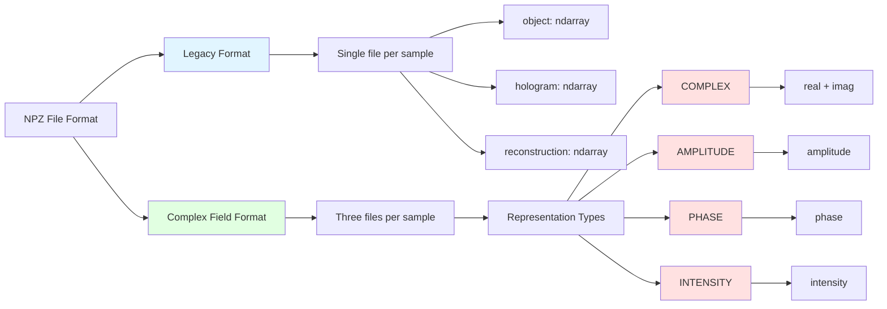
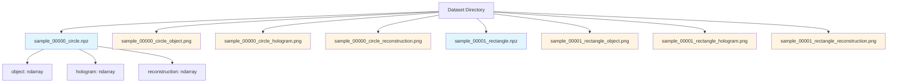
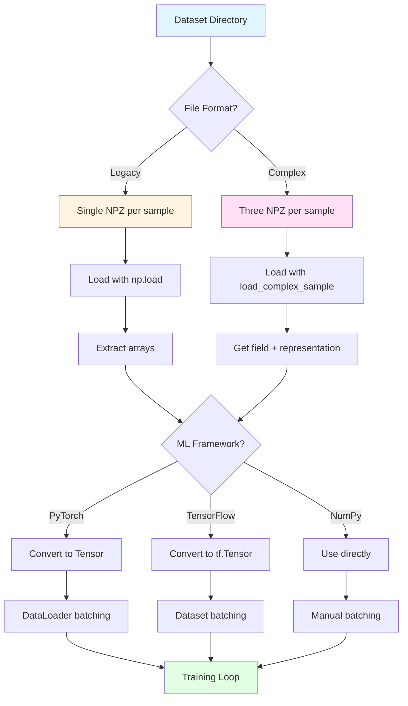
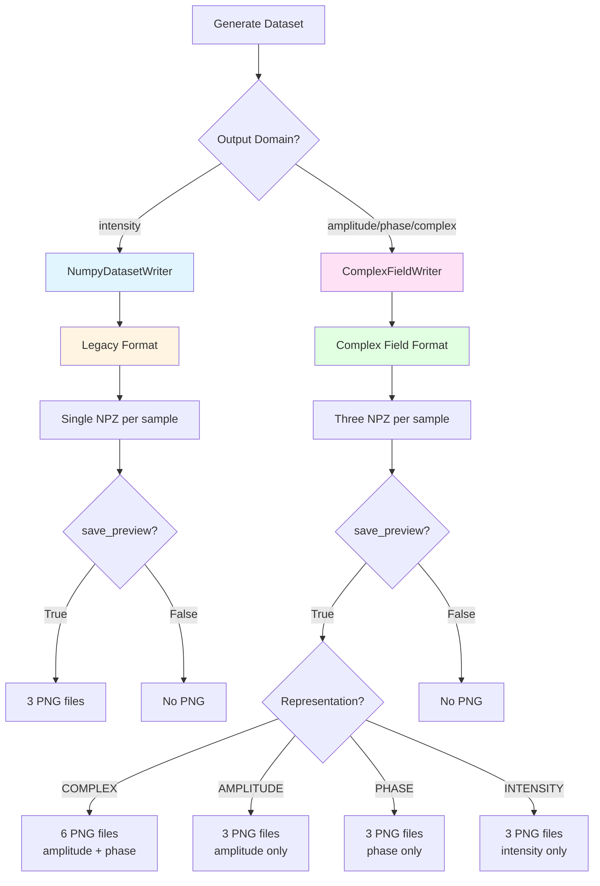
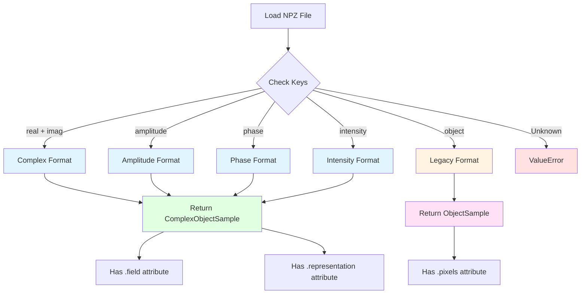

# I/O Formats and Data Loading

HoloGen provides flexible file formats and data loading utilities for persisting and loading holography datasets. This document explains the file formats, directory structure, writer classes, and how to load data in various ML frameworks.

## File Format Overview

HoloGen supports two primary file formats for dataset storage:

1. **NumPy Archive (.npz)**: Binary format containing field data and metadata
2. **PNG Preview Images**: Visual previews for quick inspection

The toolkit provides two writer classes that handle different field representations:

- **NumpyDatasetWriter**: For intensity-only (legacy) datasets
- **ComplexFieldWriter**: For complex field datasets with amplitude and phase

Both formats are designed for efficient storage and fast loading in machine learning pipelines.

## NPZ File Format

### File Format Structure Overview



### Legacy Intensity Format

The original HoloGen format stores intensity-only data in a single `.npz` file per sample.

**File structure**:
```python
{
    'object': np.ndarray,        # Object domain intensity (H, W)
    'hologram': np.ndarray,      # Hologram intensity (H, W)
    'reconstruction': np.ndarray # Reconstructed intensity (H, W)
}
```

**Characteristics**:
- Single file per sample
- All arrays are real-valued float64
- Shape: (height, width)
- Intensity values typically in [0, 1] range
- Backward compatible with older HoloGen versions

**Example loading**:
```python
import numpy as np

# Load legacy format
data = np.load('sample_00000_circle.npz')
object_intensity = data['object']
hologram_intensity = data['hologram']
reconstruction = data['reconstruction']
```

### Complex Field Format

The new format supports complex-valued fields with multiple representation types. Each domain (object, hologram, reconstruction) is stored in a separate `.npz` file.

**File structure for COMPLEX representation**:
```python
{
    'representation': str,  # 'complex'
    'real': np.ndarray,     # Real component (H, W)
    'imag': np.ndarray      # Imaginary component (H, W)
}
```

**File structure for AMPLITUDE representation**:
```python
{
    'representation': str,  # 'amplitude'
    'amplitude': np.ndarray # Amplitude values (H, W)
}
```

**File structure for PHASE representation**:
```python
{
    'representation': str,  # 'phase'
    'phase': np.ndarray     # Phase in radians (H, W), range [-π, π]
}
```

**File structure for INTENSITY representation**:
```python
{
    'representation': str,   # 'intensity'
    'intensity': np.ndarray  # Intensity values (H, W)
}
```

**Characteristics**:
- Three files per sample (object, hologram, reconstruction)
- Representation type stored as metadata
- Complex fields stored as real/imaginary components
- Phase values in radians [-π, π]
- All arrays are float64 (or complex128 when reconstructed)

**Example loading**:
```python
from hologen.utils.io import load_complex_sample

# Automatic format detection
sample = load_complex_sample('sample_00000_circle_object.npz')

# Access field data
if hasattr(sample, 'field'):
    # Complex field format
    complex_field = sample.field
    representation = sample.representation
else:
    # Legacy intensity format
    intensity = sample.pixels
```

## PNG Preview Format

PNG previews provide visual inspection of generated samples without loading the full numerical data.

### Intensity/Amplitude Previews

Grayscale 8-bit PNG images normalized to [0, 255] range.

**Naming convention**:
- Legacy: `sample_XXXXX_name_object.png`, `sample_XXXXX_name_hologram.png`, `sample_XXXXX_name_reconstruction.png`
- Complex (amplitude): `sample_XXXXX_name_object.png`, `sample_XXXXX_name_hologram.png`, `sample_XXXXX_name_reconstruction.png`
- Complex (intensity): `sample_XXXXX_name_object.png`, `sample_XXXXX_name_hologram.png`, `sample_XXXXX_name_reconstruction.png`

### Phase Previews

Phase values are mapped from [-π, π] to [0, 255] and optionally colored using matplotlib colormaps.

**Naming convention**:
- `sample_XXXXX_name_object.png` (for phase-only objects)
- `sample_XXXXX_name_hologram.png` (for phase-only holograms)

**Default colormap**: `twilight` (cyclic colormap for phase visualization)

### Complex Field Previews

When using COMPLEX representation, two separate PNG files are generated:

**Naming convention**:
- `sample_XXXXX_name_object_amplitude.png`
- `sample_XXXXX_name_object_phase.png`
- `sample_XXXXX_name_hologram_amplitude.png`
- `sample_XXXXX_name_hologram_phase.png`
- `sample_XXXXX_name_reconstruction_amplitude.png`
- `sample_XXXXX_name_reconstruction_phase.png`

## Directory Structure

### Legacy Format Structure

```
dataset/
├── sample_00000_circle.npz
├── sample_00000_circle_object.png
├── sample_00000_circle_hologram.png
├── sample_00000_circle_reconstruction.png
├── sample_00001_rectangle.npz
├── sample_00001_rectangle_object.png
├── sample_00001_rectangle_hologram.png
├── sample_00001_rectangle_reconstruction.png
└── ...
```

**Visual representation**:



### Complex Field Format Structure

```
dataset/
├── sample_00000_circle_object.npz
├── sample_00000_circle_object_amplitude.png
├── sample_00000_circle_object_phase.png
├── sample_00000_circle_hologram.npz
├── sample_00000_circle_hologram_amplitude.png
├── sample_00000_circle_hologram_phase.png
├── sample_00000_circle_reconstruction.npz
├── sample_00000_circle_reconstruction_amplitude.png
├── sample_00000_circle_reconstruction_phase.png
├── sample_00001_rectangle_object.npz
├── sample_00001_rectangle_object.png
├── sample_00001_rectangle_hologram.npz
├── sample_00001_rectangle_hologram.png
├── sample_00001_rectangle_reconstruction.npz
├── sample_00001_rectangle_reconstruction.png
└── ...
```

**Visual representation**:



```mermaid
graph TD
    A[Dataset Directory] --> B[Sample 00000 - circle]
    A --> C[Sample 00001 - rectangle]
    
    B --> B1[object.npz]
    B --> B2[object_amplitude.png]
    B --> B3[object_phase.png]
    B --> B4[hologram.npz]
    B --> B5[hologram_amplitude.png]
    B --> B6[hologram_phase.png]
    B --> B7[reconstruction.npz]
    B --> B8[reconstruction_amplitude.png]
    B --> B9[reconstruction_phase.png]
    
    C --> C1[object.npz]
    C --> C2[object.png]
    C --> C3[hologram.npz]
    C --> C4[hologram.png]
    C --> C5[reconstruction.npz]
    C --> C6[reconstruction.png]
    
    B1 --> B1A[real: ndarray]
    B1 --> B1B[imag: ndarray]
    B1 --> B1C[representation: 'complex']
    
    C1 --> C1A[amplitude: ndarray]
    C1 --> C1B[representation: 'amplitude']
    
    style B1 fill:#e1f5ff
    style B4 fill:#e1f5ff
    style B7 fill:#e1f5ff
    style C1 fill:#e1f5ff
    style C3 fill:#e1f5ff
    style C5 fill:#e1f5ff
    style B2 fill:#fff4e1
    style B3 fill:#ffe1f5
    style B5 fill:#fff4e1
    style B6 fill:#ffe1f5
    style B8 fill:#fff4e1
    style B9 fill:#ffe1f5
    style C2 fill:#fff4e1
    style C4 fill:#fff4e1
    style C6 fill:#fff4e1
```

**File naming pattern**: `sample_{index:05d}_{shape_name}_{domain}.{ext}`

Where:
- `index`: Zero-padded 5-digit sample number
- `shape_name`: Name of the shape generator used
- `domain`: `object`, `hologram`, or `reconstruction`
- `ext`: `npz` for data, `png` for previews

## Loading Data in ML Frameworks

### Data Loading Workflow



### PyTorch DataLoader

```python
import torch
from torch.utils.data import Dataset, DataLoader
import numpy as np
from pathlib import Path

class HologramDataset(Dataset):
    """PyTorch dataset for HoloGen holography data."""
    
    def __init__(self, data_dir: str, transform=None):
        self.data_dir = Path(data_dir)
        # Find all .npz files (legacy format)
        self.samples = sorted(self.data_dir.glob('sample_*.npz'))
        # Filter to only main files (not _object, _hologram, _reconstruction)
        self.samples = [s for s in self.samples 
                       if not any(x in s.stem for x in ['_object', '_hologram', '_reconstruction'])]
        self.transform = transform
    
    def __len__(self):
        return len(self.samples)
    
    def __getitem__(self, idx):
        # Load NPZ file
        data = np.load(self.samples[idx])
        
        # Extract hologram and object
        hologram = data['hologram'].astype(np.float32)
        object_img = data['object'].astype(np.float32)
        
        # Add channel dimension: (H, W) -> (1, H, W)
        hologram = hologram[np.newaxis, ...]
        object_img = object_img[np.newaxis, ...]
        
        # Convert to tensors
        hologram = torch.from_numpy(hologram)
        object_img = torch.from_numpy(object_img)
        
        if self.transform:
            hologram = self.transform(hologram)
            object_img = self.transform(object_img)
        
        return hologram, object_img

# Usage
dataset = HologramDataset('dataset/')
dataloader = DataLoader(dataset, batch_size=32, shuffle=True, num_workers=4)

for holograms, objects in dataloader:
    # Train your model
    # holograms: (batch, 1, H, W)
    # objects: (batch, 1, H, W)
    pass
```

### PyTorch with Complex Fields

```python
import torch
from torch.utils.data import Dataset, DataLoader
import numpy as np
from pathlib import Path
from hologen.utils.io import load_complex_sample

class ComplexHologramDataset(Dataset):
    """PyTorch dataset for complex field holography data."""
    
    def __init__(self, data_dir: str, domain='hologram'):
        self.data_dir = Path(data_dir)
        self.domain = domain
        # Find all object files to get sample count
        self.samples = sorted(self.data_dir.glob(f'sample_*_object.npz'))
    
    def __len__(self):
        return len(self.samples)
    
    def __getitem__(self, idx):
        # Get base filename
        object_file = self.samples[idx]
        base_name = object_file.stem.replace('_object', '')
        
        # Load object and hologram
        object_sample = load_complex_sample(object_file)
        hologram_file = self.data_dir / f'{base_name}_hologram.npz'
        hologram_sample = load_complex_sample(hologram_file)
        
        # Convert to tensors
        # For complex fields, separate real and imaginary parts
        object_field = object_sample.field.astype(np.complex64)
        hologram_field = hologram_sample.field.astype(np.complex64)
        
        # Stack real and imaginary as channels: (2, H, W)
        object_tensor = torch.stack([
            torch.from_numpy(object_field.real),
            torch.from_numpy(object_field.imag)
        ])
        
        hologram_tensor = torch.stack([
            torch.from_numpy(hologram_field.real),
            torch.from_numpy(hologram_field.imag)
        ])
        
        return hologram_tensor, object_tensor

# Usage
dataset = ComplexHologramDataset('dataset/')
dataloader = DataLoader(dataset, batch_size=16, shuffle=True)

for holograms, objects in dataloader:
    # holograms: (batch, 2, H, W) - real and imaginary channels
    # objects: (batch, 2, H, W)
    pass
```

### TensorFlow Dataset

```python
import tensorflow as tf
import numpy as np
from pathlib import Path

def load_hologram_sample(file_path):
    """Load a single hologram sample."""
    data = np.load(file_path.numpy().decode())
    hologram = data['hologram'].astype(np.float32)
    object_img = data['object'].astype(np.float32)
    
    # Add channel dimension
    hologram = hologram[..., np.newaxis]
    object_img = object_img[..., np.newaxis]
    
    return hologram, object_img

def create_hologram_dataset(data_dir: str, batch_size: int = 32):
    """Create TensorFlow dataset for holography data."""
    data_path = Path(data_dir)
    
    # Get all sample files
    sample_files = sorted(data_path.glob('sample_*.npz'))
    sample_files = [str(s) for s in sample_files 
                   if not any(x in s for x in ['_object', '_hologram', '_reconstruction'])]
    
    # Create dataset from file paths
    dataset = tf.data.Dataset.from_tensor_slices(sample_files)
    
    # Load data using py_function
    dataset = dataset.map(
        lambda x: tf.py_function(
            load_hologram_sample,
            [x],
            [tf.float32, tf.float32]
        ),
        num_parallel_calls=tf.data.AUTOTUNE
    )
    
    # Set shapes (replace with your actual dimensions)
    dataset = dataset.map(lambda h, o: (
        tf.ensure_shape(h, [256, 256, 1]),
        tf.ensure_shape(o, [256, 256, 1])
    ))
    
    # Batch and prefetch
    dataset = dataset.batch(batch_size)
    dataset = dataset.prefetch(tf.data.AUTOTUNE)
    
    return dataset

# Usage
dataset = create_hologram_dataset('dataset/', batch_size=32)

for holograms, objects in dataset:
    # Train your model
    # holograms: (batch, H, W, 1)
    # objects: (batch, H, W, 1)
    pass
```

### NumPy Batch Loading

```python
import numpy as np
from pathlib import Path
from typing import Tuple

def load_batch(data_dir: str, batch_size: int = 32, 
               start_idx: int = 0) -> Tuple[np.ndarray, np.ndarray]:
    """Load a batch of hologram samples using NumPy.
    
    Args:
        data_dir: Directory containing .npz files
        batch_size: Number of samples to load
        start_idx: Starting sample index
    
    Returns:
        Tuple of (holograms, objects) arrays with shape (batch, H, W)
    """
    data_path = Path(data_dir)
    sample_files = sorted(data_path.glob('sample_*.npz'))
    sample_files = [s for s in sample_files 
                   if not any(x in s.stem for x in ['_object', '_hologram', '_reconstruction'])]
    
    # Select batch
    batch_files = sample_files[start_idx:start_idx + batch_size]
    
    # Load first sample to get dimensions
    first_data = np.load(batch_files[0])
    h, w = first_data['hologram'].shape
    
    # Preallocate arrays
    holograms = np.zeros((len(batch_files), h, w), dtype=np.float32)
    objects = np.zeros((len(batch_files), h, w), dtype=np.float32)
    
    # Load all samples
    for i, file_path in enumerate(batch_files):
        data = np.load(file_path)
        holograms[i] = data['hologram']
        objects[i] = data['object']
    
    return holograms, objects

# Usage
holograms, objects = load_batch('dataset/', batch_size=32, start_idx=0)
print(f"Loaded batch: holograms {holograms.shape}, objects {objects.shape}")
```

### Memory-Efficient Loading with Generators

```python
import numpy as np
from pathlib import Path
from typing import Iterator, Tuple

def hologram_generator(data_dir: str, batch_size: int = 32) -> Iterator[Tuple[np.ndarray, np.ndarray]]:
    """Memory-efficient generator for hologram data.
    
    Args:
        data_dir: Directory containing .npz files
        batch_size: Number of samples per batch
    
    Yields:
        Tuples of (holograms, objects) arrays
    """
    data_path = Path(data_dir)
    sample_files = sorted(data_path.glob('sample_*.npz'))
    sample_files = [s for s in sample_files 
                   if not any(x in s.stem for x in ['_object', '_hologram', '_reconstruction'])]
    
    # Process in batches
    for i in range(0, len(sample_files), batch_size):
        batch_files = sample_files[i:i + batch_size]
        
        # Load first to get dimensions
        first_data = np.load(batch_files[0])
        h, w = first_data['hologram'].shape
        
        # Preallocate
        holograms = np.zeros((len(batch_files), h, w), dtype=np.float32)
        objects = np.zeros((len(batch_files), h, w), dtype=np.float32)
        
        # Load batch
        for j, file_path in enumerate(batch_files):
            data = np.load(file_path)
            holograms[j] = data['hologram']
            objects[j] = data['object']
        
        yield holograms, objects

# Usage
for holograms, objects in hologram_generator('dataset/', batch_size=32):
    # Process batch
    print(f"Processing batch: {holograms.shape}")
```

## Writer Classes

### Writer Selection Flow



### NumpyDatasetWriter

Writes intensity-only datasets in the legacy format.

**Class definition**:
```python
from hologen.utils.io import NumpyDatasetWriter

writer = NumpyDatasetWriter(save_preview=True)
```

**Parameters**:
- `save_preview` (bool): Whether to generate PNG preview images. Default: `True`

**Output files per sample**:
- `sample_XXXXX_name.npz`: Contains object, hologram, and reconstruction intensities
- `sample_XXXXX_name_object.png`: Object domain preview (if save_preview=True)
- `sample_XXXXX_name_hologram.png`: Hologram preview (if save_preview=True)
- `sample_XXXXX_name_reconstruction.png`: Reconstruction preview (if save_preview=True)

**Usage example**:
```python
from pathlib import Path
from hologen.utils.io import NumpyDatasetWriter
from hologen.converters import HologramDatasetGenerator

# Create writer
writer = NumpyDatasetWriter(save_preview=True)

# Generate samples (from your pipeline)
generator = HologramDatasetGenerator(...)
samples = generator.generate(count=100, config=config, rng=rng)

# Save to disk
writer.save(samples=samples, output_dir=Path('dataset/'))
```

### ComplexFieldWriter

Writes complex field datasets with support for multiple representations.

**Class definition**:
```python
from hologen.utils.io import ComplexFieldWriter

writer = ComplexFieldWriter(
    save_preview=True,
    phase_colormap='twilight'
)
```

**Parameters**:
- `save_preview` (bool): Whether to generate PNG preview images. Default: `True`
- `phase_colormap` (str): Matplotlib colormap name for phase visualization. Default: `'twilight'`

**Output files per sample** (COMPLEX representation):
- `sample_XXXXX_name_object.npz`: Object field (real/imag)
- `sample_XXXXX_name_object_amplitude.png`: Amplitude preview
- `sample_XXXXX_name_object_phase.png`: Phase preview (colored)
- `sample_XXXXX_name_hologram.npz`: Hologram field (real/imag)
- `sample_XXXXX_name_hologram_amplitude.png`: Amplitude preview
- `sample_XXXXX_name_hologram_phase.png`: Phase preview (colored)
- `sample_XXXXX_name_reconstruction.npz`: Reconstruction field (real/imag)
- `sample_XXXXX_name_reconstruction_amplitude.png`: Amplitude preview
- `sample_XXXXX_name_reconstruction_phase.png`: Phase preview (colored)

**Usage example**:
```python
from pathlib import Path
from hologen.utils.io import ComplexFieldWriter
from hologen.converters import HologramDatasetGenerator
from hologen.types import OutputConfig, FieldRepresentation

# Create writer with custom colormap
writer = ComplexFieldWriter(
    save_preview=True,
    phase_colormap='hsv'  # Alternative colormap
)

# Configure output representations
output_config = OutputConfig(
    object_representation=FieldRepresentation.COMPLEX,
    hologram_representation=FieldRepresentation.COMPLEX,
    reconstruction_representation=FieldRepresentation.COMPLEX
)

# Generate samples
generator = HologramDatasetGenerator(...)
samples = generator.generate(
    count=100, 
    config=config, 
    rng=rng,
    use_complex=True
)

# Save to disk
writer.save(samples=samples, output_dir=Path('dataset/'))
```

## Backward Compatibility

HoloGen maintains backward compatibility with legacy intensity-only datasets.

### Loading Legacy Data

The `load_complex_sample()` function automatically detects the file format:

```python
from hologen.utils.io import load_complex_sample

# Works with both legacy and new formats
sample = load_complex_sample('sample_00000_circle.npz')

# Check format
if hasattr(sample, 'field'):
    print("New complex field format")
    print(f"Representation: {sample.representation}")
else:
    print("Legacy intensity format")
```

### Format Detection Logic



The loader checks for specific keys in the `.npz` file:

1. **Complex format**: Contains `'real'` and `'imag'` keys
2. **Amplitude format**: Contains `'amplitude'` key
3. **Phase format**: Contains `'phase'` key
4. **Intensity format (new)**: Contains `'intensity'` key
5. **Legacy format**: Contains `'object'` key

### Migration Strategy

To migrate from legacy to complex field format:

```python
from pathlib import Path
import numpy as np
from hologen.utils.io import load_complex_sample, ComplexFieldWriter
from hologen.types import ComplexObjectSample, FieldRepresentation

def migrate_legacy_dataset(input_dir: Path, output_dir: Path):
    """Migrate legacy intensity dataset to complex field format."""
    
    # Find all legacy files
    legacy_files = sorted(input_dir.glob('sample_*.npz'))
    legacy_files = [f for f in legacy_files 
                   if not any(x in f.stem for x in ['_object', '_hologram', '_reconstruction'])]
    
    output_dir.mkdir(parents=True, exist_ok=True)
    
    for legacy_file in legacy_files:
        # Load legacy data
        data = np.load(legacy_file)
        
        # Convert to complex field format
        object_field = data['object'].astype(np.complex128)
        hologram_field = data['hologram'].astype(np.complex128)
        reconstruction_field = data['reconstruction'].astype(np.complex128)
        
        # Extract sample name
        # sample_00000_circle.npz -> sample_00000_circle
        base_name = legacy_file.stem
        
        # Save in new format
        np.savez(
            output_dir / f'{base_name}_object.npz',
            intensity=np.abs(object_field)**2,
            representation='intensity'
        )
        np.savez(
            output_dir / f'{base_name}_hologram.npz',
            intensity=np.abs(hologram_field)**2,
            representation='intensity'
        )
        np.savez(
            output_dir / f'{base_name}_reconstruction.npz',
            intensity=np.abs(reconstruction_field)**2,
            representation='intensity'
        )
    
    print(f"Migrated {len(legacy_files)} samples to {output_dir}")

# Usage
migrate_legacy_dataset(Path('old_dataset/'), Path('new_dataset/'))
```

## API Reference

### load_complex_sample()

```python
def load_complex_sample(path: Path) -> ComplexObjectSample | ObjectSample
```

Load a sample from a NumPy archive with automatic format detection.

**Parameters**:
- `path` (Path): Path to the `.npz` file

**Returns**:
- `ComplexObjectSample`: If the file contains complex field data (new format)
- `ObjectSample`: If the file contains legacy intensity data

**Raises**:
- `ValueError`: If the file format is not recognized
- `IOError`: If the file cannot be read

**Example**:
```python
from pathlib import Path
from hologen.utils.io import load_complex_sample

# Load any format
sample = load_complex_sample(Path('sample_00000_circle_object.npz'))

# Access data based on type
if hasattr(sample, 'field'):
    # Complex field format
    field = sample.field
    representation = sample.representation
    name = sample.name
else:
    # Legacy format
    intensity = sample.pixels
    name = sample.name
```

### NumpyDatasetWriter.save()

```python
def save(self, samples: Iterable[HologramSample], output_dir: Path) -> None
```

Write hologram samples to disk in legacy intensity format.

**Parameters**:
- `samples` (Iterable[HologramSample]): Iterable of hologram samples
- `output_dir` (Path): Target directory for dataset files

**Raises**:
- `IOError`: If the dataset cannot be written

**Example**:
```python
from pathlib import Path
from hologen.utils.io import NumpyDatasetWriter

writer = NumpyDatasetWriter(save_preview=True)
writer.save(samples=my_samples, output_dir=Path('output/'))
```

### ComplexFieldWriter.save()

```python
def save(self, samples: Iterable[ComplexHologramSample], output_dir: Path) -> None
```

Write complex hologram samples to disk.

**Parameters**:
- `samples` (Iterable[ComplexHologramSample]): Iterable of complex hologram samples
- `output_dir` (Path): Target directory for dataset files

**Raises**:
- `IOError`: If the dataset cannot be written

**Example**:
```python
from pathlib import Path
from hologen.utils.io import ComplexFieldWriter

writer = ComplexFieldWriter(save_preview=True, phase_colormap='twilight')
writer.save(samples=my_complex_samples, output_dir=Path('output/'))
```

## Performance Considerations

### Storage Requirements

**Legacy format** (per sample):
- NPZ file: ~200-500 KB (3 arrays: object, hologram, reconstruction)
- PNG previews: ~50-150 KB (3 images)
- Total: ~250-650 KB per sample

**Complex field format** (per sample):
- NPZ files: ~600-1500 KB (3 files with real/imag or single component)
- PNG previews: ~100-300 KB (3-6 images depending on representation)
- Total: ~700-1800 KB per sample

**Recommendations**:
- Use `save_preview=False` for large datasets to save disk space
- Use intensity representation when phase is not needed
- Consider compression for long-term storage

### Loading Performance

**NumPy loading**:
- Fastest for small datasets
- Simple implementation
- No parallelization

**PyTorch DataLoader**:
- Best for training neural networks
- Parallel loading with `num_workers`
- Automatic batching and shuffling
- Recommended: `num_workers=4` for most systems

**TensorFlow Dataset**:
- Optimized for TensorFlow models
- Automatic prefetching with `AUTOTUNE`
- Good integration with TF training loops

**Memory-efficient generators**:
- Best for datasets larger than RAM
- Minimal memory footprint
- Sequential access only

## Troubleshooting

### Common Issues

**Issue**: `ValueError: Unknown .npz format`

**Solution**: The file doesn't contain recognized keys. Check that the file was generated by HoloGen or contains one of the expected key sets.

**Issue**: PNG previews are all black or white

**Solution**: Check that field values are properly normalized. Intensity values should be in a reasonable range (typically [0, 1] or [0, 255]).

**Issue**: Phase previews look incorrect

**Solution**: Verify that phase values are in radians [-π, π]. If using a custom colormap, ensure matplotlib is installed.

**Issue**: Out of memory when loading large datasets

**Solution**: Use memory-efficient generators or reduce batch size. Consider using PyTorch DataLoader with multiple workers.

**Issue**: Slow loading performance

**Solution**: Use parallel loading (PyTorch `num_workers` or TensorFlow `AUTOTUNE`). Store data on fast storage (SSD). Reduce preview generation with `save_preview=False`.

## See Also

- **[Complex Fields Documentation](COMPLEX_FIELDS.md)** - Understanding field representations (intensity, amplitude, phase, complex)
- **[Pipeline Documentation](PIPELINE.md)** - Dataset generation pipeline and writer integration
- **[CLI Reference](CLI_REFERENCE.md)** - Command-line dataset generation with --output-domain options
- **[API Reference](API_REFERENCE.md)** - Complete API documentation for NumpyDatasetWriter and ComplexFieldWriter
- **[Utilities](UTILITIES.md)** - Utility functions for loading and converting field data
- **[Examples](EXAMPLES.md)** - Practical examples for loading data in PyTorch, TensorFlow, and NumPy (Examples 2, 3, 10)
- **[Quickstart Guide](QUICKSTART.md)** - Quick start with data loading examples
- **[Shapes](SHAPES.md)** - Shape generators that produce the object data stored in files
