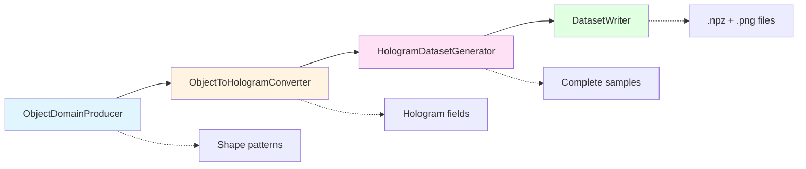
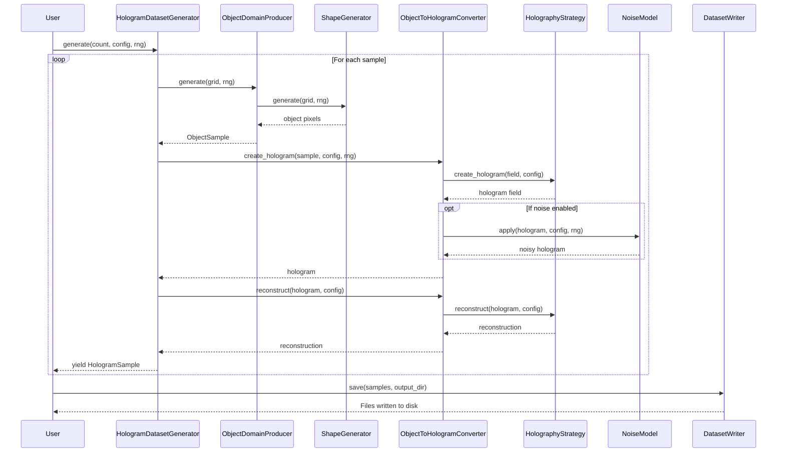
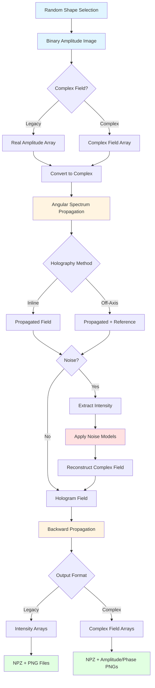

# Pipeline Architecture

## Overview

HoloGen uses a modular, protocol-based pipeline architecture to generate synthetic hologram datasets. The pipeline transforms object-domain patterns through holographic propagation, applies realistic noise, and persists the results to disk.

### Pipeline Flow

The dataset generation pipeline consists of four main stages:

1. **Object Generation**: Create object-domain patterns using shape generators
2. **Hologram Creation**: Transform objects into holograms using holography strategies
3. **Reconstruction**: Recover object-domain fields from holograms
4. **Persistence**: Write samples to disk in NumPy and PNG formats



### Key Design Principles

- **Protocol-based**: Components implement protocols (duck typing) for flexibility
- **Immutable configuration**: Configuration objects are passed through the pipeline
- **Strategy pattern**: Holography methods (inline/off-axis) are interchangeable strategies
- **Composable**: Mix and match components to create custom pipelines
- **Type-safe**: Explicit type hints for NumPy arrays and data structures

## Component Interaction Diagram

The following diagram shows how components interact during sample generation:



## Data Transformation Flow

This diagram illustrates how data is transformed through the pipeline:



## Components

### 1. ObjectDomainProducer

**Purpose**: Generate object-domain samples by randomly selecting from registered shape generators.

**Protocol**: None (concrete class)

**Key Methods**:
- `generate(grid, rng)`: Produce a legacy intensity-based object sample
- `generate_complex(grid, rng, phase_shift, mode)`: Produce a complex field object sample

**Configuration**: Initialized with a tuple of shape generators

**Example**:
```python
from hologen import ObjectDomainProducer, CircleGenerator, RectangleGenerator
from hologen.types import GridSpec
import numpy as np

# Create producer with specific generators
producer = ObjectDomainProducer(
    shape_generators=(CircleGenerator(), RectangleGenerator())
)

# Generate object sample
grid = GridSpec(height=512, width=512, pixel_pitch=5e-6)
rng = np.random.default_rng(seed=42)
sample = producer.generate(grid, rng)

print(f"Generated {sample.name} with shape {sample.pixels.shape}")
# Output: Generated circle with shape (512, 512)
```

**Complex Field Generation**:
```python
# Generate phase-only object
complex_sample = producer.generate_complex(
    grid=grid,
    rng=rng,
    phase_shift=np.pi/2,  # 90-degree phase shift
    mode="phase"
)

print(f"Field representation: {complex_sample.representation}")
# Output: Field representation: phase
```

### 2. ObjectToHologramConverter

**Purpose**: Transform object-domain fields into holograms and perform reconstruction using holography strategies.

**Protocol**: None (concrete class)

**Key Methods**:
- `create_hologram(sample, config, rng)`: Generate hologram from object sample
- `reconstruct(hologram, config)`: Recover object field from hologram

**Configuration**:
- `strategy_mapping`: Dictionary mapping holography methods to strategy implementations
- `noise_model`: Optional noise model to apply during hologram creation
- `output_config`: Configuration for field representations

**Example**:
```python
from hologen import ObjectToHologramConverter
from hologen.holography.inline import InlineHolographyStrategy
from hologen.holography.off_axis import OffAxisHolographyStrategy
from hologen.types import HolographyMethod, HolographyConfig, OpticalConfig

# Create converter with both strategies
converter = ObjectToHologramConverter(
    strategy_mapping={
        HolographyMethod.INLINE: InlineHolographyStrategy(),
        HolographyMethod.OFF_AXIS: OffAxisHolographyStrategy(),
    }
)

# Configure holography parameters
config = HolographyConfig(
    grid=grid,
    optics=OpticalConfig(wavelength=532e-9, propagation_distance=0.1),
    method=HolographyMethod.INLINE
)

# Create hologram
hologram = converter.create_hologram(sample, config, rng)
reconstruction = converter.reconstruct(hologram, config)
```

**With Noise**:
```python
from hologen.noise import SensorNoiseModel

# Add sensor noise
noise_model = SensorNoiseModel(
    name="sensor",
    read_noise=10.0,
    shot_noise=True,
    dark_current=5.0,
    bit_depth=12
)

converter = ObjectToHologramConverter(
    strategy_mapping={HolographyMethod.INLINE: InlineHolographyStrategy()},
    noise_model=noise_model
)

# Noise is applied during hologram creation
noisy_hologram = converter.create_hologram(sample, config, rng)
```

### 3. HologramDatasetGenerator

**Purpose**: Orchestrate the complete pipeline to generate multiple hologram samples.

**Protocol**: Implements `DatasetGenerator` protocol

**Key Methods**:
- `generate(count, config, rng, phase_shift, mode, use_complex)`: Yield hologram samples

**Configuration**:
- `object_producer`: ObjectDomainProducer instance
- `converter`: ObjectToHologramConverter instance

**Example**:
```python
from hologen import HologramDatasetGenerator

# Assemble pipeline
generator = HologramDatasetGenerator(
    object_producer=producer,
    converter=converter
)

# Generate 10 samples
samples = list(generator.generate(
    count=10,
    config=config,
    rng=rng
))

print(f"Generated {len(samples)} samples")
for i, sample in enumerate(samples[:3]):
    print(f"  Sample {i}: {sample.object_sample.name}")
```

**Complex Field Pipeline**:
```python
# Generate complex field samples
complex_samples = list(generator.generate(
    count=10,
    config=config,
    rng=rng,
    phase_shift=np.pi/4,
    mode="phase",
    use_complex=True
))

# Access complex fields
sample = complex_samples[0]
print(f"Object representation: {sample.object_sample.representation}")
print(f"Hologram representation: {sample.hologram_representation}")
print(f"Reconstruction representation: {sample.reconstruction_representation}")
```

### 4. DatasetWriter

**Purpose**: Persist generated samples to disk in NumPy archives and PNG previews.

**Protocol**: Implements `DatasetWriter` protocol

**Implementations**:
- `NumpyDatasetWriter`: Legacy intensity-based format
- `ComplexFieldWriter`: Complex field format with multiple representations

**Key Methods**:
- `save(samples, output_dir)`: Write samples to specified directory

**Example (Legacy Format)**:
```python
from hologen.utils.io import NumpyDatasetWriter
from pathlib import Path

# Create writer with PNG previews
writer = NumpyDatasetWriter(save_preview=True)

# Save samples
writer.save(samples, output_dir=Path("dataset"))

# Directory structure:
# dataset/
#   sample_00000_circle.npz
#   sample_00000_circle_object.png
#   sample_00000_circle_hologram.png
#   sample_00000_circle_reconstruction.png
#   ...
```

**Example (Complex Field Format)**:
```python
from hologen.utils.io import ComplexFieldWriter

# Create writer with phase colormap
writer = ComplexFieldWriter(
    save_preview=True,
    phase_colormap="twilight"
)

# Save complex samples
writer.save(complex_samples, output_dir=Path("complex_dataset"))

# Directory structure:
# complex_dataset/
#   sample_00000_circle_object.npz
#   sample_00000_circle_object_amplitude.png
#   sample_00000_circle_object_phase.png
#   sample_00000_circle_hologram.npz
#   sample_00000_circle_hologram_amplitude.png
#   sample_00000_circle_hologram_phase.png
#   ...
```

## Configuration Objects

### GridSpec

Defines the spatial sampling grid for all fields in the pipeline.

**Fields**:
- `height` (int): Number of pixels along vertical axis
- `width` (int): Number of pixels along horizontal axis
- `pixel_pitch` (float): Sampling interval in meters

**Example**:
```python
from hologen.types import GridSpec

# 512×512 grid with 5 μm pixels
grid = GridSpec(height=512, width=512, pixel_pitch=5e-6)

# Physical dimensions
physical_height = grid.height * grid.pixel_pitch  # 2.56 mm
physical_width = grid.width * grid.pixel_pitch    # 2.56 mm
```

### OpticalConfig

Specifies the physical parameters for wave propagation.

**Fields**:
- `wavelength` (float): Illumination wavelength in meters
- `propagation_distance` (float): Object-to-sensor distance in meters

**Example**:
```python
from hologen.types import OpticalConfig

# Green laser at 10 cm distance
optics = OpticalConfig(
    wavelength=532e-9,           # 532 nm
    propagation_distance=0.1     # 10 cm
)
```

### HolographyConfig

Bundles grid, optical, and method parameters for the pipeline.

**Fields**:
- `grid` (GridSpec): Spatial sampling specification
- `optics` (OpticalConfig): Physical propagation parameters
- `method` (HolographyMethod): Holography strategy (INLINE or OFF_AXIS)
- `carrier` (OffAxisCarrier | None): Carrier configuration for off-axis

**Example (Inline)**:
```python
from hologen.types import HolographyConfig, HolographyMethod

config = HolographyConfig(
    grid=GridSpec(height=512, width=512, pixel_pitch=5e-6),
    optics=OpticalConfig(wavelength=532e-9, propagation_distance=0.1),
    method=HolographyMethod.INLINE
)
```

**Example (Off-Axis)**:
```python
from hologen.types import OffAxisCarrier

config = HolographyConfig(
    grid=GridSpec(height=512, width=512, pixel_pitch=5e-6),
    optics=OpticalConfig(wavelength=532e-9, propagation_distance=0.1),
    method=HolographyMethod.OFF_AXIS,
    carrier=OffAxisCarrier(
        frequency_x=2e5,      # 200 cycles/mm
        frequency_y=2e5,      # 200 cycles/mm
        gaussian_width=5e4    # 50 cycles/mm filter width
    )
)
```

### OutputConfig

Controls field representations in the output samples.

**Fields**:
- `object_representation` (FieldRepresentation): Object domain representation
- `hologram_representation` (FieldRepresentation): Hologram representation
- `reconstruction_representation` (FieldRepresentation): Reconstruction representation

**Representations**:
- `INTENSITY`: |E|² (intensity)
- `AMPLITUDE`: |E| (amplitude)
- `PHASE`: arg(E) (phase)
- `COMPLEX`: E (full complex field)

**Example**:
```python
from hologen.types import OutputConfig, FieldRepresentation

# Save amplitude and phase separately
output_config = OutputConfig(
    object_representation=FieldRepresentation.AMPLITUDE,
    hologram_representation=FieldRepresentation.COMPLEX,
    reconstruction_representation=FieldRepresentation.AMPLITUDE
)

converter = ObjectToHologramConverter(
    strategy_mapping={HolographyMethod.INLINE: InlineHolographyStrategy()},
    output_config=output_config
)
```

### NoiseConfig

Configures all noise and aberration parameters.

**Fields**:
- **Sensor Noise**:
  - `sensor_read_noise` (float): Gaussian read noise std dev
  - `sensor_shot_noise` (bool): Enable Poisson shot noise
  - `sensor_dark_current` (float): Mean dark current
  - `sensor_bit_depth` (int | None): ADC quantization bits
- **Speckle Noise**:
  - `speckle_contrast` (float): Contrast ratio [0, 1]
  - `speckle_correlation_length` (float): Correlation length in pixels
- **Aberrations**:
  - `aberration_defocus` (float): Defocus coefficient
  - `aberration_astigmatism_x` (float): Astigmatism X coefficient
  - `aberration_astigmatism_y` (float): Astigmatism Y coefficient
  - `aberration_coma_x` (float): Coma X coefficient
  - `aberration_coma_y` (float): Coma Y coefficient

**Example**:
```python
from hologen.types import NoiseConfig
from hologen.converters import create_noise_model

# Configure realistic sensor noise
noise_config = NoiseConfig(
    sensor_read_noise=10.0,
    sensor_shot_noise=True,
    sensor_dark_current=5.0,
    sensor_bit_depth=12,
    speckle_contrast=0.3,
    speckle_correlation_length=2.0
)

# Create composite noise model
noise_model = create_noise_model(noise_config)

# Use in converter
converter = ObjectToHologramConverter(
    strategy_mapping={HolographyMethod.INLINE: InlineHolographyStrategy()},
    noise_model=noise_model
)
```

## End-to-End Examples

### Example 1: Basic Dataset Generation

Generate a simple dataset with default settings:

```python
from hologen import (
    ObjectDomainProducer,
    ObjectToHologramConverter,
    HologramDatasetGenerator,
)
from hologen.shapes import available_generators
from hologen.holography.inline import InlineHolographyStrategy
from hologen.types import (
    GridSpec,
    OpticalConfig,
    HolographyConfig,
    HolographyMethod,
)
from hologen.utils.io import NumpyDatasetWriter
import numpy as np
from pathlib import Path

# Setup
grid = GridSpec(height=512, width=512, pixel_pitch=5e-6)
optics = OpticalConfig(wavelength=532e-9, propagation_distance=0.1)
config = HolographyConfig(grid=grid, optics=optics, method=HolographyMethod.INLINE)
rng = np.random.default_rng(seed=42)

# Build pipeline
producer = ObjectDomainProducer(shape_generators=tuple(available_generators()))
converter = ObjectToHologramConverter(
    strategy_mapping={HolographyMethod.INLINE: InlineHolographyStrategy()}
)
generator = HologramDatasetGenerator(object_producer=producer, converter=converter)

# Generate samples
samples = list(generator.generate(count=100, config=config, rng=rng))

# Save to disk
writer = NumpyDatasetWriter(save_preview=True)
writer.save(samples, output_dir=Path("basic_dataset"))

print(f"Generated {len(samples)} samples in basic_dataset/")
```

### Example 2: Off-Axis with Noise

Generate off-axis holograms with realistic noise:

```python
from hologen.holography.off_axis import OffAxisHolographyStrategy
from hologen.types import OffAxisCarrier, NoiseConfig
from hologen.converters import create_noise_model

# Configure off-axis holography
config = HolographyConfig(
    grid=GridSpec(height=512, width=512, pixel_pitch=5e-6),
    optics=OpticalConfig(wavelength=532e-9, propagation_distance=0.1),
    method=HolographyMethod.OFF_AXIS,
    carrier=OffAxisCarrier(
        frequency_x=2e5,
        frequency_y=2e5,
        gaussian_width=5e4
    )
)

# Configure noise
noise_config = NoiseConfig(
    sensor_read_noise=15.0,
    sensor_shot_noise=True,
    sensor_dark_current=10.0,
    sensor_bit_depth=12,
    speckle_contrast=0.4,
    speckle_correlation_length=2.5
)
noise_model = create_noise_model(noise_config)

# Build pipeline with noise
producer = ObjectDomainProducer(shape_generators=tuple(available_generators()))
converter = ObjectToHologramConverter(
    strategy_mapping={HolographyMethod.OFF_AXIS: OffAxisHolographyStrategy()},
    noise_model=noise_model
)
generator = HologramDatasetGenerator(object_producer=producer, converter=converter)

# Generate and save
samples = list(generator.generate(count=100, config=config, rng=rng))
writer = NumpyDatasetWriter(save_preview=True)
writer.save(samples, output_dir=Path("offaxis_noisy_dataset"))
```

### Example 3: Complex Field Pipeline

Generate phase-only objects with complex field output:

```python
from hologen.types import OutputConfig, FieldRepresentation
from hologen.utils.io import ComplexFieldWriter

# Configure complex field output
output_config = OutputConfig(
    object_representation=FieldRepresentation.PHASE,
    hologram_representation=FieldRepresentation.COMPLEX,
    reconstruction_representation=FieldRepresentation.COMPLEX
)

# Build pipeline
producer = ObjectDomainProducer(shape_generators=tuple(available_generators()))
converter = ObjectToHologramConverter(
    strategy_mapping={HolographyMethod.INLINE: InlineHolographyStrategy()},
    output_config=output_config
)
generator = HologramDatasetGenerator(object_producer=producer, converter=converter)

# Generate complex samples
config = HolographyConfig(
    grid=GridSpec(height=512, width=512, pixel_pitch=5e-6),
    optics=OpticalConfig(wavelength=532e-9, propagation_distance=0.1),
    method=HolographyMethod.INLINE
)

complex_samples = list(generator.generate(
    count=100,
    config=config,
    rng=rng,
    phase_shift=np.pi/2,  # 90-degree phase shift
    mode="phase",
    use_complex=True
))

# Save with complex field writer
writer = ComplexFieldWriter(save_preview=True, phase_colormap="twilight")
writer.save(complex_samples, output_dir=Path("phase_only_dataset"))
```

### Example 4: Custom Shape Generators

Use only specific shape generators:

```python
from hologen import CircleGenerator, RingGenerator

# Create producer with specific generators
producer = ObjectDomainProducer(
    shape_generators=(CircleGenerator(), RingGenerator())
)

# Rest of pipeline as usual
converter = ObjectToHologramConverter(
    strategy_mapping={HolographyMethod.INLINE: InlineHolographyStrategy()}
)
generator = HologramDatasetGenerator(object_producer=producer, converter=converter)

samples = list(generator.generate(count=50, config=config, rng=rng))
print(f"Generated samples with shapes: {set(s.object_sample.name for s in samples)}")
# Output: Generated samples with shapes: {'circle', 'ring'}
```

## Protocol-Based Design

HoloGen uses Python protocols (structural subtyping) to define component interfaces. This enables duck typing and makes the pipeline highly extensible.

### Architecture Overview

The following diagram shows the protocol-based architecture:

```mermaid
classDiagram
    class ObjectShapeGenerator {
        <<Protocol>>
        +name: str
        +generate(grid, rng) ArrayFloat
        +generate_complex(grid, rng, phase_shift, mode) ArrayComplex
    }
    
    class HolographyStrategy {
        <<Protocol>>
        +create_hologram(field, config) ArrayComplex
        +reconstruct(hologram, config) ArrayComplex
    }
    
    class NoiseModel {
        <<Protocol>>
        +apply(hologram, config, rng) ArrayFloat
    }
    
    class DatasetWriter {
        <<Protocol>>
        +save(samples, output_dir) None
    }
    
    class DatasetGenerator {
        <<Protocol>>
        +generate(count, config, rng) Iterable
    }
    
    class ObjectDomainProducer {
        -shape_generators: tuple
        +generate(grid, rng) ObjectSample
        +generate_complex(grid, rng, phase_shift, mode) ComplexObjectSample
    }
    
    class ObjectToHologramConverter {
        -strategy_mapping: dict
        -noise_model: NoiseModel
        -output_config: OutputConfig
        +create_hologram(sample, config, rng) Array
        +reconstruct(hologram, config) Array
    }
    
    class HologramDatasetGenerator {
        -object_producer: ObjectDomainProducer
        -converter: ObjectToHologramConverter
        +generate(count, config, rng, ...) Iterable
    }
    
    class InlineHolographyStrategy {
        +create_hologram(field, config) ArrayComplex
        +reconstruct(hologram, config) ArrayComplex
    }
    
    class OffAxisHolographyStrategy {
        +create_hologram(field, config) ArrayComplex
        +reconstruct(hologram, config) ArrayComplex
    }
    
    class CircleGenerator {
        +name: str
        +generate(grid, rng) ArrayFloat
    }
    
    class SensorNoiseModel {
        +apply(hologram, config, rng) ArrayFloat
    }
    
    class NumpyDatasetWriter {
        +save(samples, output_dir) None
    }
    
    ObjectDomainProducer --> ObjectShapeGenerator : uses
    ObjectToHologramConverter --> HolographyStrategy : uses
    ObjectToHologramConverter --> NoiseModel : uses
    HologramDatasetGenerator --> ObjectDomainProducer : contains
    HologramDatasetGenerator --> ObjectToHologramConverter : contains
    HologramDatasetGenerator ..|> DatasetGenerator : implements
    
    InlineHolographyStrategy ..|> HolographyStrategy : implements
    OffAxisHolographyStrategy ..|> HolographyStrategy : implements
    CircleGenerator ..|> ObjectShapeGenerator : implements
    SensorNoiseModel ..|> NoiseModel : implements
    NumpyDatasetWriter ..|> DatasetWriter : implements
```



### Core Protocols

#### ObjectShapeGenerator

Defines the interface for shape generators:

```python
from typing import Protocol
from hologen.types import GridSpec, ArrayFloat
from numpy.random import Generator

class ObjectShapeGenerator(Protocol):
    @property
    def name(self) -> str:
        """Return the canonical name of the generator."""
    
    def generate(self, grid: GridSpec, rng: Generator) -> ArrayFloat:
        """Create a binary object-domain image."""
```

Any class implementing these methods can be used as a shape generator.

#### HolographyStrategy

Defines the interface for holography methods:

```python
from typing import Protocol
from hologen.types import ArrayComplex, HolographyConfig

class HolographyStrategy(Protocol):
    def create_hologram(
        self, object_field: ArrayComplex, config: HolographyConfig
    ) -> ArrayComplex:
        """Create a hologram from an object-domain complex field."""
    
    def reconstruct(
        self, hologram: ArrayComplex, config: HolographyConfig
    ) -> ArrayComplex:
        """Recover an object-domain complex field from a hologram."""
```

Implement this protocol to create custom holography methods.

#### DatasetWriter

Defines the interface for dataset persistence:

```python
from typing import Protocol
from collections.abc import Iterable
from pathlib import Path
from hologen.types import HologramSample

class DatasetWriter(Protocol):
    def save(self, samples: Iterable[HologramSample], output_dir: Path) -> None:
        """Persist a sequence of hologram samples."""
```

Implement this protocol to create custom output formats.

#### NoiseModel

Defines the interface for noise simulation:

```python
from typing import Protocol
from hologen.types import ArrayFloat, HolographyConfig
from numpy.random import Generator

class NoiseModel(Protocol):
    def apply(
        self, hologram: ArrayFloat, config: HolographyConfig, rng: Generator
    ) -> ArrayFloat:
        """Apply noise to a hologram."""
```

Implement this protocol to create custom noise models.

### Creating Custom Components

#### Custom Shape Generator

```python
from hologen.types import GridSpec, ArrayFloat
from numpy.random import Generator
import numpy as np

class StarGenerator:
    """Generate star-shaped objects."""
    
    @property
    def name(self) -> str:
        return "star"
    
    def generate(self, grid: GridSpec, rng: Generator) -> ArrayFloat:
        # Implementation details...
        pixels = np.zeros((grid.height, grid.width))
        # Draw star shape
        return pixels

# Use in pipeline
producer = ObjectDomainProducer(
    shape_generators=(StarGenerator(), CircleGenerator())
)
```

#### Custom Holography Strategy

```python
from hologen.types import ArrayComplex, HolographyConfig

class CustomHolographyStrategy:
    """Custom holography implementation."""
    
    def create_hologram(
        self, object_field: ArrayComplex, config: HolographyConfig
    ) -> ArrayComplex:
        # Custom hologram generation logic
        pass
    
    def reconstruct(
        self, hologram: ArrayComplex, config: HolographyConfig
    ) -> ArrayComplex:
        # Custom reconstruction logic
        pass

# Use in pipeline
converter = ObjectToHologramConverter(
    strategy_mapping={
        HolographyMethod.INLINE: CustomHolographyStrategy()
    }
)
```

#### Custom Writer

```python
from collections.abc import Iterable
from pathlib import Path
from hologen.types import HologramSample
import h5py

class HDF5Writer:
    """Write samples to HDF5 format."""
    
    def save(self, samples: Iterable[HologramSample], output_dir: Path) -> None:
        output_dir.mkdir(parents=True, exist_ok=True)
        
        with h5py.File(output_dir / "dataset.h5", "w") as f:
            for i, sample in enumerate(samples):
                grp = f.create_group(f"sample_{i:05d}")
                grp.create_dataset("object", data=sample.object_sample.pixels)
                grp.create_dataset("hologram", data=sample.hologram)
                grp.create_dataset("reconstruction", data=sample.reconstruction)

# Use in pipeline
writer = HDF5Writer()
writer.save(samples, output_dir=Path("hdf5_dataset"))
```

## API Reference

### ObjectDomainProducer

```python
@dataclass(slots=True)
class ObjectDomainProducer:
    shape_generators: tuple[ObjectShapeGenerator, ...]
    
    def generate(self, grid: GridSpec, rng: Generator) -> ObjectSample:
        """Produce a legacy intensity-based object sample."""
    
    def generate_complex(
        self,
        grid: GridSpec,
        rng: Generator,
        phase_shift: float = 0.0,
        mode: str = "amplitude",
    ) -> ComplexObjectSample:
        """Produce a complex field object sample."""
```

### ObjectToHologramConverter

```python
@dataclass(slots=True)
class ObjectToHologramConverter:
    strategy_mapping: dict[HolographyMethod, HolographyStrategy]
    noise_model: NoiseModel | None = None
    output_config: OutputConfig = field(default_factory=OutputConfig)
    
    def create_hologram(
        self,
        sample: ObjectSample | ComplexObjectSample,
        config: HolographyConfig,
        rng: Generator | None = None,
    ) -> ArrayFloat | ArrayComplex:
        """Generate a hologram for the provided object sample."""
    
    def reconstruct(
        self, hologram: ArrayFloat | ArrayComplex, config: HolographyConfig
    ) -> ArrayFloat | ArrayComplex:
        """Reconstruct an object-domain field from a hologram."""
```

### HologramDatasetGenerator

```python
@dataclass(slots=True)
class HologramDatasetGenerator(DatasetGenerator):
    object_producer: ObjectDomainProducer
    converter: ObjectToHologramConverter
    
    def generate(
        self,
        count: int,
        config: HolographyConfig,
        rng: Generator,
        phase_shift: float = 0.0,
        mode: str = "amplitude",
        use_complex: bool = False,
    ) -> Iterable[HologramSample | ComplexHologramSample]:
        """Yield hologram samples as an iterable sequence."""
```

### Factory Functions

```python
def default_object_producer() -> ObjectDomainProducer:
    """Create the default object domain producer with built-in shapes."""

def default_converter(
    noise_model: NoiseModel | None = None,
) -> ObjectToHologramConverter:
    """Create the default converter with inline and off-axis strategies."""

def generate_dataset(
    count: int,
    config: HolographyConfig,
    rng: Generator,
    writer: DatasetWriter,
    generator: HologramDatasetGenerator | None = None,
    output_dir: Path | None = None,
) -> None:
    """Generate and persist a holography dataset using the pipeline."""

def create_noise_model(config: NoiseConfig) -> NoiseModel | None:
    """Create a composite noise model from configuration."""
```

## Best Practices

### 1. Use Factory Functions for Defaults

The factory functions provide sensible defaults:

```python
from hologen.converters import default_object_producer, default_converter

producer = default_object_producer()  # All built-in shapes
converter = default_converter()       # Both inline and off-axis
```

### 2. Reuse Configuration Objects

Create configuration objects once and reuse them:

```python
# Good: Reuse config
config = HolographyConfig(...)
samples = list(generator.generate(count=1000, config=config, rng=rng))

# Avoid: Creating config in loop
for i in range(1000):
    config = HolographyConfig(...)  # Wasteful
```

### 3. Use Generators for Memory Efficiency

The pipeline yields samples lazily. Process them in batches:

```python
# Memory-efficient: Process in batches
for batch_start in range(0, 10000, 100):
    samples = list(generator.generate(count=100, config=config, rng=rng))
    writer.save(samples, output_dir=Path(f"batch_{batch_start}"))
```

### 4. Validate Configuration Early

Check configuration validity before generating large datasets:

```python
# Generate one sample to validate
test_samples = list(generator.generate(count=1, config=config, rng=rng))
assert len(test_samples) == 1, "Pipeline validation failed"

# Now generate full dataset
samples = list(generator.generate(count=10000, config=config, rng=rng))
```

### 5. Use Type Hints

Leverage type hints for better IDE support:

```python
from hologen.types import HologramSample

samples: list[HologramSample] = list(
    generator.generate(count=10, config=config, rng=rng)
)
```

## Troubleshooting

### Issue: "Unknown holography method"

**Cause**: The converter's strategy mapping doesn't include the requested method.

**Solution**: Ensure the strategy mapping includes the method specified in config:

```python
# Wrong: Missing OFF_AXIS strategy
converter = ObjectToHologramConverter(
    strategy_mapping={HolographyMethod.INLINE: InlineHolographyStrategy()}
)
config = HolographyConfig(..., method=HolographyMethod.OFF_AXIS)  # Error!

# Correct: Include both strategies
converter = ObjectToHologramConverter(
    strategy_mapping={
        HolographyMethod.INLINE: InlineHolographyStrategy(),
        HolographyMethod.OFF_AXIS: OffAxisHolographyStrategy(),
    }
)
```

### Issue: "Off-axis holography requires carrier configuration"

**Cause**: Using OFF_AXIS method without providing carrier parameters.

**Solution**: Include OffAxisCarrier in the configuration:

```python
from hologen.types import OffAxisCarrier

config = HolographyConfig(
    grid=grid,
    optics=optics,
    method=HolographyMethod.OFF_AXIS,
    carrier=OffAxisCarrier(
        frequency_x=2e5,
        frequency_y=2e5,
        gaussian_width=5e4
    )
)
```

### Issue: Noise not being applied

**Cause**: Forgot to pass `rng` to `create_hologram()`.

**Solution**: Always pass the random number generator when using noise:

```python
# Wrong: No rng, noise won't be applied
hologram = converter.create_hologram(sample, config)

# Correct: Pass rng for noise application
hologram = converter.create_hologram(sample, config, rng)
```

### Issue: Memory usage too high

**Cause**: Generating all samples at once.

**Solution**: Process samples in batches or use streaming:

```python
# Memory-efficient approach
batch_size = 100
for batch_idx in range(0, total_samples, batch_size):
    samples = list(generator.generate(
        count=min(batch_size, total_samples - batch_idx),
        config=config,
        rng=rng
    ))
    writer.save(samples, output_dir=Path(f"batch_{batch_idx // batch_size}"))
```

## See Also

## See Also

- **[Shape Generators](SHAPES.md)** - Available object-domain patterns and how to create custom generators
- **[Holography Methods](HOLOGRAPHY_METHODS.md)** - Inline and off-axis strategies used by ObjectToHologramConverter
- **[Noise Simulation](NOISE_SIMULATION.md)** - Realistic noise and aberration models integrated into the pipeline
- **[Complex Fields](COMPLEX_FIELDS.md)** - Complex field generation and representation in the pipeline
- **[I/O Formats](IO_FORMATS.md)** - File formats and data loading with NumpyDatasetWriter and ComplexFieldWriter
- **[CLI Reference](CLI_REFERENCE.md)** - Command-line interface that uses the pipeline internally
- **[API Reference](API_REFERENCE.md)** - Complete API documentation for all pipeline components
- **[Utilities](UTILITIES.md)** - Utility functions used throughout the pipeline
- **[Examples](EXAMPLES.md)** - Practical examples including pipeline customization (Example 6)
- **[Quickstart Guide](QUICKSTART.md)** - Quick start with the default pipeline
