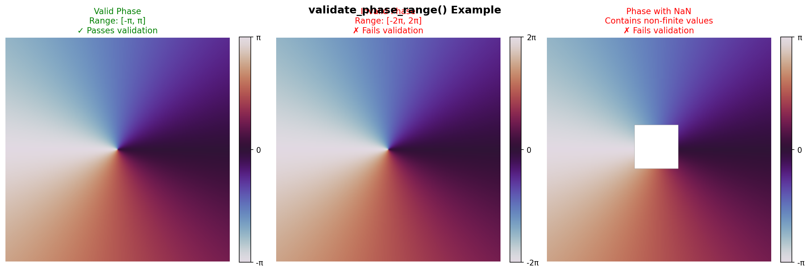
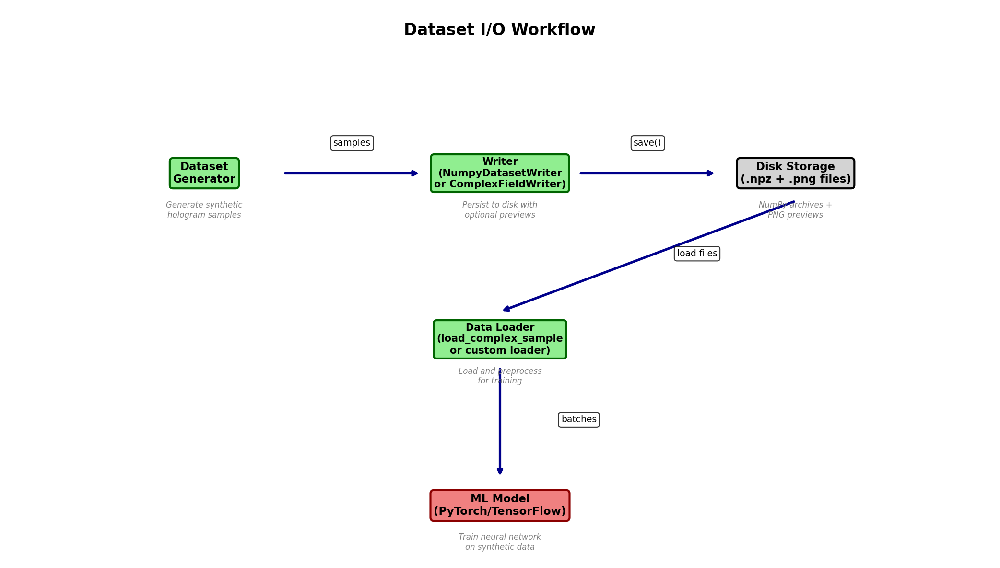
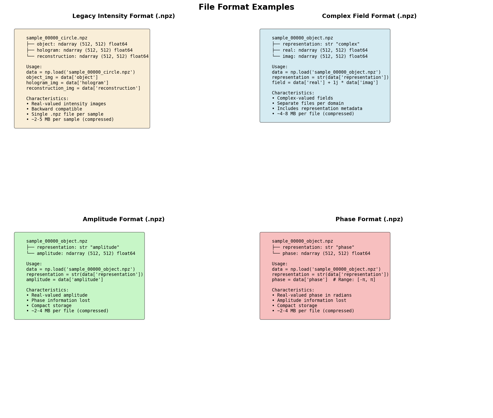
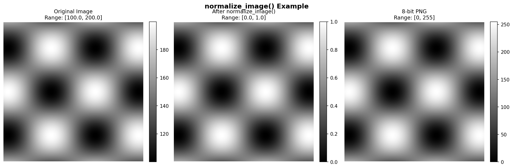

# Utility Functions Reference

HoloGen provides a comprehensive set of utility functions for working with optical fields, managing dataset I/O operations, and performing mathematical transformations. This document covers all utility modules and their functions, with practical examples and performance considerations.

## Overview

The utility modules are organized into three main categories:

- **Field Utilities** (`hologen.utils.fields`): Complex field conversions and validation
- **I/O Utilities** (`hologen.utils.io`): Dataset writers and loaders
- **Math Utilities** (`hologen.utils.math`): Mathematical operations and transformations

### Visual Overview


The diagram above shows the relationships between different field representations and the utility functions that convert between them.

## Field Utilities

The `hologen.utils.fields` module provides functions for converting between different field representations and validating field data.

### complex_to_representation()

Convert a complex optical field to a specific representation (intensity, amplitude, phase, or complex).

**Signature**:
```python
def complex_to_representation(
    field: ArrayComplex, 
    representation: FieldRepresentation
) -> ArrayFloat | ArrayComplex
```

**Parameters**:
- `field`: Complex-valued optical field (numpy array with dtype complex128)
- `representation`: Target representation type from `FieldRepresentation` enum

**Returns**:
- `ArrayFloat` for intensity, amplitude, and phase representations
- `ArrayComplex` for complex representation (returns input unchanged)

**Raises**:
- `FieldRepresentationError`: If the representation type is invalid

**Usage Examples**:

```python
from hologen.utils.fields import complex_to_representation
from hologen.types import FieldRepresentation
import numpy as np

# Create a complex field
field = np.array([[1+1j, 2+0j], [0+2j, 1-1j]], dtype=np.complex128)

# Convert to intensity
intensity = complex_to_representation(field, FieldRepresentation.INTENSITY)
# Result: [[2.0, 4.0], [4.0, 2.0]]

# Convert to amplitude
amplitude = complex_to_representation(field, FieldRepresentation.AMPLITUDE)
# Result: [[1.414, 2.0], [2.0, 1.414]]

# Convert to phase
phase = complex_to_representation(field, FieldRepresentation.PHASE)
# Result: [[0.785, 0.0], [1.571, -0.785]] (in radians)

# Keep as complex (no conversion)
complex_field = complex_to_representation(field, FieldRepresentation.COMPLEX)
# Result: same as input
```

See the [conversion flow diagram](#visual-overview) above for a visual representation of these conversions.

**Performance Considerations**:
- Intensity conversion: O(n) with two operations per element (abs + square)
- Amplitude conversion: O(n) with one operation per element (abs)
- Phase conversion: O(n) with one operation per element (angle)
- Complex conversion: O(1) (no computation, returns input)

**Common Use Cases**:
- Converting hologram fields for visualization
- Preparing data for intensity-only ML models
- Extracting phase information for quantitative phase imaging
- Pipeline transformations between processing stages

### amplitude_phase_to_complex()

Construct a complex field from separate amplitude and phase arrays.

**Signature**:
```python
def amplitude_phase_to_complex(
    amplitude: ArrayFloat, 
    phase: ArrayFloat
) -> ArrayComplex
```

**Parameters**:
- `amplitude`: Amplitude values (non-negative real array)
- `phase`: Phase values in radians (real array)

**Returns**:
- Complex field with specified amplitude and phase

**Mathematical Formula**:
```
field = amplitude × exp(i × phase)
```

**Usage Examples**:

```python
from hologen.utils.fields import amplitude_phase_to_complex
import numpy as np

# Create amplitude and phase arrays
amplitude = np.array([[1.0, 2.0], [1.5, 0.5]], dtype=np.float64)
phase = np.array([[0.0, np.pi/2], [np.pi, -np.pi/2]], dtype=np.float64)

# Construct complex field
field = amplitude_phase_to_complex(amplitude, phase)
# Result: [[1+0j, 0+2j], [-1.5+0j, 0-0.5j]]
```

**Performance Considerations**:
- O(n) complexity with one exp operation per element
- Exponential computation is relatively expensive
- Consider caching results if used repeatedly with same phase values

**Common Use Cases**:
- Reconstructing complex fields from separate amplitude/phase measurements
- Creating synthetic fields with controlled amplitude and phase patterns
- Implementing custom phase modulation schemes
- Converting from polar to Cartesian representation

### validate_phase_range()

Validate that all phase values are within the valid [-π, π] range.

**Signature**:
```python
def validate_phase_range(phase: ArrayFloat) -> None
```

**Parameters**:
- `phase`: Phase array in radians

**Returns**:
- None (raises exception if validation fails)

**Raises**:
- `PhaseRangeError`: If any phase values are outside [-π, π] or non-finite (NaN/Inf)

**Usage Examples**:

```python
from hologen.utils.fields import validate_phase_range, PhaseRangeError
import numpy as np

# Valid phase array
valid_phase = np.array([[0.0, np.pi/2], [-np.pi/2, np.pi]], dtype=np.float64)
validate_phase_range(valid_phase)  # No error

# Invalid phase array (out of range)
invalid_phase = np.array([[0.0, 4.0]], dtype=np.float64)
try:
    validate_phase_range(invalid_phase)
except PhaseRangeError as e:
    print(f"Validation failed: {e}")
    # Output: "Phase values must be in the range [-π, π] radians. Found values in range [0.0000, 4.0000]."

# Invalid phase array (non-finite)
nan_phase = np.array([[0.0, np.nan]], dtype=np.float64)
try:
    validate_phase_range(nan_phase)
except PhaseRangeError as e:
    print(f"Validation failed: {e}")
    # Output: "Phase array contains non-finite values (NaN or Inf). All phase values must be finite numbers."
```

**Visual Example**:



The diagram above shows examples of valid and invalid phase arrays, illustrating what the validation function checks for.

**Performance Considerations**:
- O(n) complexity with two passes over the array
- First pass checks for finite values
- Second pass checks range bounds
- Minimal overhead for valid data

**Common Use Cases**:
- Validating phase data before saving to disk
- Debugging phase computation errors
- Ensuring phase wrapping was applied correctly
- Input validation in custom processing functions

### Exception Classes

**FieldRepresentationError**

Raised when a field representation is invalid or incompatible.

```python
from hologen.utils.fields import FieldRepresentationError

# Inherits from ValueError
# Raised by complex_to_representation() for invalid representation types
```

**PhaseRangeError**

Raised when phase values are outside the valid [-π, π] range.

```python
from hologen.utils.fields import PhaseRangeError

# Inherits from ValueError
# Raised by validate_phase_range() for out-of-range or non-finite values
```

## I/O Utilities

The `hologen.utils.io` module provides classes for writing datasets to disk and loading samples from saved files.

### I/O Workflow Overview



The diagram above illustrates the complete workflow from dataset generation through storage to ML model training.

### NumpyDatasetWriter

Persist holography samples in NumPy archives (.npz) with optional PNG previews.

**Class Definition**:
```python
@dataclass(slots=True)
class NumpyDatasetWriter:
    save_preview: bool = True
```

**Parameters**:
- `save_preview`: Whether to generate PNG preview images for each domain (default: True)

**Methods**:

#### save()

Write hologram samples to disk.

**Signature**:
```python
def save(self, samples: Iterable[HologramSample], output_dir: Path) -> None
```

**Parameters**:
- `samples`: Iterable of `HologramSample` objects from the pipeline
- `output_dir`: Target directory for dataset files

**Raises**:
- `IOError`: If files cannot be written to disk

**File Format**:

Each sample generates the following files:
- `sample_XXXXX_<name>.npz`: NumPy archive with keys:
  - `object`: Object-domain intensity image
  - `hologram`: Hologram-domain intensity image
  - `reconstruction`: Reconstructed object-domain intensity image
- `sample_XXXXX_<name>_object.png`: Object preview (if save_preview=True)
- `sample_XXXXX_<name>_hologram.png`: Hologram preview (if save_preview=True)
- `sample_XXXXX_<name>_reconstruction.png`: Reconstruction preview (if save_preview=True)

**File Format Examples**:



The diagram above shows the structure and contents of different file formats supported by HoloGen.

**Usage Example**:

```python
from hologen.utils.io import NumpyDatasetWriter
from hologen.converters import create_hologram_dataset_generator
from hologen.types import GridSpec, OpticalConfig, HolographyConfig
from pathlib import Path

# Create dataset generator
grid = GridSpec(height=512, width=512, pixel_pitch=1e-6)
optical = OpticalConfig(wavelength=532e-9, distance=0.01)
holography = HolographyConfig(method="inline")

generator = create_hologram_dataset_generator(
    grid=grid,
    optical=optical,
    holography=holography,
    num_samples=10
)

# Write dataset with previews
writer = NumpyDatasetWriter(save_preview=True)
samples = generator.generate()
writer.save(samples, Path("output/dataset"))

# Write dataset without previews (faster, less disk space)
writer_no_preview = NumpyDatasetWriter(save_preview=False)
writer_no_preview.save(samples, Path("output/dataset_no_preview"))
```

**Performance Considerations**:
- PNG generation adds ~30-50% overhead to write time
- Disable previews for large-scale dataset generation
- Each sample writes 1 .npz file + 3 PNG files (if enabled)
- PNG files are 8-bit grayscale, ~10-50 KB each
- .npz files are compressed, size depends on image complexity

**Common Use Cases**:
- Generating training datasets for intensity-based ML models
- Creating datasets compatible with legacy HoloGen versions
- Quick dataset generation with visual verification
- Batch processing with preview disabled for speed

### ComplexFieldWriter

Persist complex holography samples in NumPy archives with optional PNG previews and phase colormaps.

**Class Definition**:
```python
@dataclass(slots=True)
class ComplexFieldWriter:
    save_preview: bool = True
    phase_colormap: str = "twilight"
```

**Parameters**:
- `save_preview`: Whether to generate PNG preview images (default: True)
- `phase_colormap`: Matplotlib colormap name for phase visualization (default: "twilight")

**Methods**:

#### save()

Write complex hologram samples to disk.

**Signature**:
```python
def save(self, samples: Iterable[ComplexHologramSample], output_dir: Path) -> None
```

**Parameters**:
- `samples`: Iterable of `ComplexHologramSample` objects from the pipeline
- `output_dir`: Target directory for dataset files

**Raises**:
- `IOError`: If files cannot be written to disk

**File Format**:

Each sample generates separate files for object, hologram, and reconstruction domains:

For COMPLEX representation:
- `<prefix>_<domain>.npz`: Contains `real`, `imag`, and `representation` keys
- `<prefix>_<domain>_amplitude.png`: Amplitude preview
- `<prefix>_<domain>_phase.png`: Phase preview with colormap

For AMPLITUDE representation:
- `<prefix>_<domain>.npz`: Contains `amplitude` and `representation` keys
- `<prefix>_<domain>.png`: Amplitude preview

For PHASE representation:
- `<prefix>_<domain>.npz`: Contains `phase` and `representation` keys
- `<prefix>_<domain>.png`: Phase preview with colormap

For INTENSITY representation:
- `<prefix>_<domain>.npz`: Contains `intensity` and `representation` keys
- `<prefix>_<domain>.png`: Intensity preview

**Usage Example**:

```python
from hologen.utils.io import ComplexFieldWriter
from hologen.converters import create_complex_hologram_generator
from hologen.types import (
    GridSpec, OpticalConfig, HolographyConfig, 
    FieldRepresentation
)
from pathlib import Path

# Create complex field generator
grid = GridSpec(height=512, width=512, pixel_pitch=1e-6)
optical = OpticalConfig(wavelength=532e-9, distance=0.01)
holography = HolographyConfig(method="inline")

generator = create_complex_hologram_generator(
    grid=grid,
    optical=optical,
    holography=holography,
    num_samples=10,
    object_representation=FieldRepresentation.PHASE,
    hologram_representation=FieldRepresentation.COMPLEX
)

# Write with default twilight colormap
writer = ComplexFieldWriter(save_preview=True, phase_colormap="twilight")
samples = generator.generate()
writer.save(samples, Path("output/complex_dataset"))

# Write with different colormap
writer_hsv = ComplexFieldWriter(save_preview=True, phase_colormap="hsv")
writer_hsv.save(samples, Path("output/complex_dataset_hsv"))

# Write without previews
writer_fast = ComplexFieldWriter(save_preview=False)
writer_fast.save(samples, Path("output/complex_dataset_fast"))
```

**Available Phase Colormaps**:
- `twilight`: Cyclic colormap, good for phase (default)
- `hsv`: Classic hue-based phase visualization
- `twilight_shifted`: Shifted twilight colormap
- Any matplotlib colormap name

**Performance Considerations**:
- Complex fields require 2x storage (real + imaginary components)
- PNG generation with colormaps requires matplotlib
- Falls back to grayscale if matplotlib unavailable
- Phase colormaps add minimal overhead (~5%)
- Disable previews for maximum write speed

**Common Use Cases**:
- Generating datasets for physics-aware ML models
- Quantitative phase imaging applications
- Full-field holographic reconstruction training data
- Research applications requiring complete field information

### load_complex_sample()

Load a sample from a NumPy archive with automatic format detection.

**Signature**:
```python
def load_complex_sample(path: Path) -> ComplexObjectSample | ObjectSample
```

**Parameters**:
- `path`: Path to the .npz file

**Returns**:
- `ComplexObjectSample` if file contains complex field data
- `ObjectSample` if file contains legacy intensity data

**Raises**:
- `ValueError`: If file format is not recognized
- `IOError`: If file cannot be read

**Supported Formats**:

The function automatically detects the format based on keys in the .npz file:

1. **Complex format**: Contains `real` and `imag` keys
2. **Amplitude format**: Contains `amplitude` key
3. **Phase format**: Contains `phase` key
4. **Intensity format**: Contains `intensity` key
5. **Legacy format**: Contains `object` key

**Usage Examples**:

```python
from hologen.utils.io import load_complex_sample
from hologen.types import ComplexObjectSample, ObjectSample
from pathlib import Path

# Load complex field data
sample = load_complex_sample(Path("output/sample_00000_object.npz"))
if isinstance(sample, ComplexObjectSample):
    print(f"Loaded complex sample: {sample.name}")
    print(f"Representation: {sample.representation}")
    print(f"Field shape: {sample.field.shape}")
    print(f"Field dtype: {sample.field.dtype}")

# Load legacy intensity data
legacy_sample = load_complex_sample(Path("output/legacy_sample.npz"))
if isinstance(legacy_sample, ObjectSample):
    print(f"Loaded legacy sample: {legacy_sample.name}")
    print(f"Pixels shape: {legacy_sample.pixels.shape}")

# Handle unknown format
try:
    unknown = load_complex_sample(Path("output/unknown.npz"))
except ValueError as e:
    print(f"Format error: {e}")
```

**Performance Considerations**:
- Lazy loading: Only reads requested file
- NumPy's load() is memory-mapped for large files
- Format detection is fast (checks dictionary keys)
- No unnecessary data copies

**Common Use Cases**:
- Loading samples for visualization
- Creating custom data loaders for ML frameworks
- Batch processing of generated datasets
- Validating dataset contents
- Migrating between legacy and complex field formats

## Math Utilities

The `hologen.utils.math` module provides mathematical operations for image processing and Fourier-domain computations.

### normalize_image()

Normalize an image to the range [0.0, 1.0] for visualization or saving.

**Signature**:
```python
def normalize_image(image: ArrayFloat) -> ArrayFloat
```

**Parameters**:
- `image`: Arbitrary floating-point image array

**Returns**:
- Normalized image in range [0.0, 1.0]
- Returns zeros array if input is constant (min == max)

**Mathematical Formula**:
```
normalized = (image - min(image)) / (max(image) - min(image))
```

**Usage Examples**:

```python
from hologen.utils.math import normalize_image
import numpy as np

# Normalize arbitrary range
image = np.array([[100, 200], [150, 250]], dtype=np.float64)
normalized = normalize_image(image)
# Result: [[0.0, 0.667], [0.333, 1.0]]

# Constant image
constant = np.ones((10, 10), dtype=np.float64) * 5.0
normalized_constant = normalize_image(constant)
# Result: zeros array (10, 10)

# Negative values
negative = np.array([[-10, 0], [5, 10]], dtype=np.float64)
normalized_negative = normalize_image(negative)
# Result: [[0.0, 0.5], [0.75, 1.0]]
```

**Visual Example**:



The diagram above demonstrates how `normalize_image()` transforms an image with arbitrary range to [0, 1] for visualization and PNG export.

**Performance Considerations**:
- O(n) complexity with two passes (min/max, then normalization)
- NumPy's vectorized operations are highly optimized
- Returns float64 for consistency
- Handles edge case of constant images gracefully

**Common Use Cases**:
- Preparing images for PNG export
- Visualizing hologram intensity patterns
- Normalizing before applying colormaps
- Preprocessing for display purposes

### make_fourier_grid()

Create Fourier-domain sampling coordinates for a spatial grid.

**Signature**:
```python
def make_fourier_grid(grid: GridSpec) -> FourierGrid
```

**Parameters**:
- `grid`: Spatial grid specification with height, width, and pixel_pitch

**Returns**:
- `FourierGrid` object containing:
  - `fx`: 2D array of spatial frequencies along x-axis (cycles/meter)
  - `fy`: 2D array of spatial frequencies along y-axis (cycles/meter)

**Usage Examples**:

```python
from hologen.utils.math import make_fourier_grid
from hologen.types import GridSpec

# Create spatial grid
grid = GridSpec(height=512, width=512, pixel_pitch=1e-6)

# Generate Fourier grid
fourier_grid = make_fourier_grid(grid)

print(f"fx shape: {fourier_grid.fx.shape}")  # (512, 512)
print(f"fy shape: {fourier_grid.fy.shape}")  # (512, 512)
print(f"Max frequency: {fourier_grid.fx.max():.2e} cycles/m")

# Use in propagation calculations
import numpy as np
wavelength = 532e-9
k = 2 * np.pi / wavelength
transfer_function = np.exp(
    1j * k * distance * np.sqrt(1 - (wavelength * fourier_grid.fx)**2 - (wavelength * fourier_grid.fy)**2)
)
```

**Performance Considerations**:
- O(n) complexity for meshgrid generation
- Results can be cached and reused for same grid
- Memory usage: 2 × height × width × 8 bytes (float64)
- Computation is fast even for large grids

**Common Use Cases**:
- Angular spectrum propagation
- Fourier-domain filtering
- Off-axis holography carrier frequency calculations
- Frequency-domain analysis

### gaussian_blur()

Apply an isotropic Gaussian blur to a 2D image.

**Signature**:
```python
def gaussian_blur(image: ArrayFloat, sigma: float) -> ArrayFloat
```

**Parameters**:
- `image`: Input image to filter
- `sigma`: Standard deviation of Gaussian kernel in pixel units

**Returns**:
- Blurred image with identical shape to input

**Mathematical Formula**:
```
kernel(x) = exp(-0.5 × (x/σ)²) / Σ(kernel)
```

**Usage Examples**:

```python
from hologen.utils.math import gaussian_blur
import numpy as np

# Create test image
image = np.zeros((100, 100), dtype=np.float64)
image[45:55, 45:55] = 1.0  # Central square

# Apply different blur levels
no_blur = gaussian_blur(image, sigma=0.0)  # Returns copy
light_blur = gaussian_blur(image, sigma=1.0)
medium_blur = gaussian_blur(image, sigma=3.0)
heavy_blur = gaussian_blur(image, sigma=10.0)

# Use in noise simulation
from hologen.noise import SpeckleNoiseModel
# Speckle noise internally uses gaussian_blur for correlation
```

**Performance Considerations**:
- Separable convolution: O(n × kernel_size) instead of O(n × kernel_size²)
- Kernel radius = 3σ (captures 99.7% of Gaussian)
- Edge padding mode: 'edge' (extends border values)
- Returns copy if sigma ≤ 0 (no computation)

**Common Use Cases**:
- Speckle noise correlation
- Optical aberration simulation
- Image smoothing for preprocessing
- Defocus simulation

### FourierGrid

Dataclass containing frequency-domain sampling coordinates.

**Class Definition**:
```python
@dataclass(slots=True)
class FourierGrid:
    fx: NDArray[np.float64]  # Spatial frequencies along x-axis
    fy: NDArray[np.float64]  # Spatial frequencies along y-axis
```

**Usage**:
```python
from hologen.utils.math import FourierGrid, make_fourier_grid
from hologen.types import GridSpec

grid = GridSpec(height=256, width=256, pixel_pitch=2e-6)
fourier_grid = make_fourier_grid(grid)

# Access frequency arrays
fx = fourier_grid.fx
fy = fourier_grid.fy

# Compute radial frequency
f_radial = np.sqrt(fx**2 + fy**2)
```

## Performance Best Practices

### Field Utilities

1. **Batch conversions**: Convert multiple fields in a loop rather than one at a time
2. **Representation selection**: Use INTENSITY for fastest conversion, PHASE for slowest
3. **Validation**: Only validate phase when necessary (e.g., before saving)
4. **Reuse arrays**: Avoid unnecessary copies by working in-place when possible

### I/O Utilities

1. **Disable previews**: Set `save_preview=False` for large-scale generation
2. **Batch writes**: Write samples in batches rather than one at a time
3. **Compression**: NumPy's .npz format automatically compresses data
4. **Parallel I/O**: Use multiple writers for parallel dataset generation
5. **SSD storage**: I/O performance benefits significantly from SSD vs HDD

### Math Utilities

1. **Cache Fourier grids**: Reuse `FourierGrid` objects for same grid specifications
2. **Normalize once**: Only normalize images when needed for visualization
3. **Blur optimization**: Use smaller sigma values when possible
4. **Vectorization**: Leverage NumPy's vectorized operations

## Integration Examples

### Complete Pipeline with Utilities

```python
from hologen import *
from hologen.utils.fields import complex_to_representation, validate_phase_range
from hologen.utils.io import ComplexFieldWriter
from hologen.utils.math import normalize_image
from pathlib import Path

# Generate complex field dataset
grid = GridSpec(height=512, width=512, pixel_pitch=1e-6)
optical = OpticalConfig(wavelength=532e-9, distance=0.01)
holography = HolographyConfig(method="inline")

generator = create_complex_hologram_generator(
    grid=grid,
    optical=optical,
    holography=holography,
    num_samples=100,
    object_representation=FieldRepresentation.PHASE,
    hologram_representation=FieldRepresentation.COMPLEX
)

# Write dataset
writer = ComplexFieldWriter(save_preview=True, phase_colormap="twilight")
samples = generator.generate()
writer.save(samples, Path("output/phase_dataset"))

# Load and process a sample
from hologen.utils.io import load_complex_sample

sample = load_complex_sample(Path("output/phase_dataset/sample_00000_object.npz"))
if isinstance(sample, ComplexObjectSample):
    # Extract phase
    phase = complex_to_representation(sample.field, FieldRepresentation.PHASE)
    
    # Validate phase range
    validate_phase_range(phase)
    
    # Normalize for visualization
    phase_normalized = normalize_image(phase)
    
    print(f"Phase range: [{phase.min():.3f}, {phase.max():.3f}] radians")
```

### Custom Data Loader for PyTorch

```python
import torch
from torch.utils.data import Dataset, DataLoader
from hologen.utils.io import load_complex_sample
from hologen.utils.fields import complex_to_representation
from hologen.types import FieldRepresentation
from pathlib import Path
import numpy as np

class HologenDataset(Dataset):
    def __init__(self, data_dir: Path, representation: FieldRepresentation):
        self.data_dir = data_dir
        self.representation = representation
        self.samples = sorted(data_dir.glob("*_object.npz"))
    
    def __len__(self):
        return len(self.samples)
    
    def __getitem__(self, idx):
        # Load sample
        sample = load_complex_sample(self.samples[idx])
        
        # Convert to desired representation
        if hasattr(sample, 'field'):
            data = complex_to_representation(sample.field, self.representation)
        else:
            data = sample.pixels
        
        # Convert to tensor
        tensor = torch.from_numpy(data).float().unsqueeze(0)
        return tensor

# Create data loader
dataset = HologenDataset(
    Path("output/phase_dataset"),
    FieldRepresentation.INTENSITY
)
loader = DataLoader(dataset, batch_size=16, shuffle=True, num_workers=4)

# Training loop
for batch in loader:
    # batch shape: (16, 1, 512, 512)
    pass
```

## See Also

- **[Complex Fields Documentation](COMPLEX_FIELDS.md)** - Detailed guide to field representations and when to use each utility
- **[I/O Formats Documentation](IO_FORMATS.md)** - Complete file format specifications and writer/loader usage
- **[API Reference](API_REFERENCE.md)** - Full API documentation for all utility functions and classes
- **[Pipeline Documentation](PIPELINE.md)** - Dataset generation pipeline that uses these utilities
- **[Holography Methods](HOLOGRAPHY_METHODS.md)** - Holography methods that use field utilities for propagation
- **[Noise Simulation](NOISE_SIMULATION.md)** - Noise models that use math utilities (gaussian_blur)
- **[Examples](EXAMPLES.md)** - Practical examples using utilities (Examples 2, 3, 9, 10)
- **[Quickstart Guide](QUICKSTART.md)** - Quick start with data loading utilities
- **[CLI Reference](CLI_REFERENCE.md)** - CLI that uses these utilities internally

## API Reference Summary

### hologen.utils.fields

| Function | Purpose | Returns |
|----------|---------|---------|
| `complex_to_representation()` | Convert complex field to specific representation | ArrayFloat or ArrayComplex |
| `amplitude_phase_to_complex()` | Construct complex field from amplitude and phase | ArrayComplex |
| `validate_phase_range()` | Validate phase values in [-π, π] range | None (raises on error) |

**Exceptions**: `FieldRepresentationError`, `PhaseRangeError`

### hologen.utils.io

| Class/Function | Purpose | Key Parameters |
|----------------|---------|----------------|
| `NumpyDatasetWriter` | Write intensity-based datasets | `save_preview` |
| `ComplexFieldWriter` | Write complex field datasets | `save_preview`, `phase_colormap` |
| `load_complex_sample()` | Load sample with format detection | `path` |

### hologen.utils.math

| Function | Purpose | Returns |
|----------|---------|---------|
| `normalize_image()` | Normalize image to [0, 1] | ArrayFloat |
| `make_fourier_grid()` | Create frequency-domain coordinates | FourierGrid |
| `gaussian_blur()` | Apply Gaussian blur filter | ArrayFloat |

**Data Classes**: `FourierGrid`
